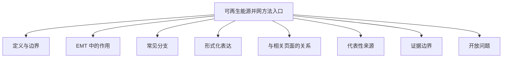

# 可再生能源并网方法入口

## 定义与边界

可再生能源并网方法入口用于承接风电、光伏、储能等并网资源接入交流或交直流电网时的建模、控制、保护和系统协调问题。它是新能源接入的上位入口，而不是某一篇数值积分、控制器或设备模型的专页。

本页讨论的是并网方法边界，不把单一求解算法或单篇案例页误写成“可再生能源并网方法”总页。

## EMT 中的作用

在 EMT 仿真中，可再生能源并网方法主要用于：

- 组织风电、光伏和储能接入系统时的接口建模；
- 研究并网控制、故障穿越和系统稳定性问题；
- 分析大规模 IBR 接入后对保护、振荡和系统协调的影响；
- 作为海上风电、并网逆变器和风电场模型页的上位入口。

## 常见分支

- 风电并网：包括 DFIG、PMSG、海上风电和风场等值。
- 光伏并网：包括并网逆变器、跟网/构网控制和场站级协调。
- 储能并网：包括频率支撑、功率平滑和并网控制。
- 混合交直流并网：包括 IBR 与 HVDC、柔性配网和混合系统耦合。

## 形式化表达

可再生能源并网的系统级最小关系可抽象写为：

$$
P_{grid}= \sum P_{ibr} - P_{loss}
$$

但对 EMT 研究而言，真正重要的是控制器、同步结构、网络强度和故障条件如何共同决定并网动态。

## 与相关页面的关系

- [[offshore-wind-integration]]：海上风电并网背景。
- [[pmsg-single-unit]]：PMSG 并网设备级背景。
- [[grid-connected-inverter]]：并网逆变器背景。
- [[frequency-control]]：并网资源频率支撑背景。
- [[power-electronics-control]]：控制总入口。

## 代表性来源

- [[parallelization-of-emt-simulations-for-integration-of-inverter-based-resources]]：大规模 IBR 接入的 EMT 计算组织背景。
- [[improved-methods-for-optimization-of-power-systems-with-renewable-generation-usi]]：可再生能源系统接入与优化背景。
- [[mitigation-of-subsynchronous-interactions-in-hybrid-acdc-grid-with-renewable-ene]]：混合交直流与可再生能源耦合背景。

## 证据边界

本页不写无来源的可接入容量、统一稳定性裕度或最优并网架构。具体结论必须绑定资源类型、网络环境和验证工况。

## 开放问题

- 当前页尚未继续拆分风电、光伏、储能和混合并网场景的细边界。
- 大规模 IBR 接入的 EMT 与机电层级分工，后续仍需在相邻页面中继续细化。
