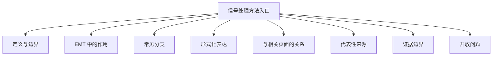

# 信号处理方法入口

## 定义与边界

信号处理方法入口用于承接 EMT 波形中的滤波、特征提取、频谱分析、模态辨识和测量数据处理问题。它是分析类方法的上位入口，而不是某一篇输电线路模型或单个设备算法页。

本页讨论的是时域/频域波形处理的通用边界，不把无关主电路模型误写成信号处理页。

## EMT 中的作用

在 EMT 研究中，信号处理方法主要用于：

- 从电压、电流和功率波形中提取特征；
- 支撑保护、诊断、稳定性分析和参数辨识；
- 组织滤波、变换、模态识别和频谱分析之间的关系；
- 为 DSP、数字继电器和测量后处理提供方法入口。

## 常见分支

- 数字滤波与预处理；
- 频谱与谐波分析；
- 模态辨识与参数提取；
- 面向保护和事件识别的特征提取。

## 形式化表达

信号处理的最小抽象可以写为：

$$
y(t)=\mathcal{F}\big(x(t)\big)
$$

其中 $x(t)$ 表示原始电磁暂态波形，$\mathcal{F}$ 表示滤波、变换或特征提取算子，$y(t)$ 表示后续用于保护、辨识或稳定性分析的结果。

## 与相关页面的关系

- [[filtering]]：滤波方法入口。
- [[prony-analysis]]：模态提取与时域辨识背景。
- [[fault-analysis-methods]]：故障波形分析背景。
- [[current-trajectory-similarity]]：轨迹特征提取背景。
- [[phase-locked-loop]]：同步与波形处理的相关背景。

## 代表性来源

- [[determination-of-the-saturation-curve-of-power-transformers-by-processing-transi]]：波形处理与参数提取背景。
- [[z-tool-frequency-domain-characterization-of-emt-models-for-small-signal-stabilit]]：频域特征分析背景。
- [[using-tacs-functions-within-empt-to-teach-protective-relaying-fundamentals-power]]：数字继电保护与 DSP 背景。

## 证据边界

本页不写无来源的最佳滤波器、统一频窗长度或所有场景通用的处理流程。具体结论必须绑定信号类型、采样条件和目标任务。

## 开放问题

- 当前页尚未继续拆分保护类信号处理、稳定性类信号处理和参数辨识类信号处理的边界。
- 不同处理链对实时性和鲁棒性的取舍，后续仍需在相邻页面中进一步展开。
