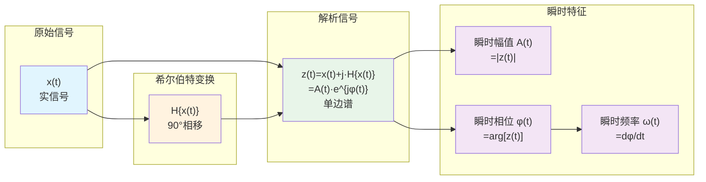

# 希尔伯特变换 (Hilbert Transform)

## 定义与边界

希尔伯特变换是一种将实信号转换为解析信号（复信号）的线性时不变算子，通过90度相移产生信号的正交分量。该变换在保持信号幅值谱不变的同时，引入-90度相移（正频率）和+90度相移（负频率），从而构建解析信号以提取瞬时特征。

在电力系统分析中，希尔伯特变换主要应用于：
- 瞬时幅值/频率/相位提取
- 包络检测与调制分析
- 振荡模态辨识与阻尼评估
- 时变谐波分析

**边界限定**：本方法基于信号窄带假设，宽频信号需采用EMD-HHT等改进方法。

## EMT中的作用

希尔伯特变换是时变信号分析的重要工具：

- **瞬时特征提取**：获取电压/电流的瞬时幅值和相位
- **低频振荡分析**：提取振荡的时变幅值与频率
- **包络检波**：检测信号包络用于故障分析
- **单边带调制**：通信与电力线载波应用

## 主要分支与机制

### 1. 经典希尔伯特变换

通过卷积实现90度相移：
$$\hat{x}(t) = x(t) * \frac{1}{\pi t} = \frac{1}{\pi}\int_{-\infty}^{\infty}\frac{x(\tau)}{t-\tau}d\tau$$

频域表达（作为乘子）：
$$\mathcal{F}\{\hat{x}(t)\} = -j\cdot\text{sgn}(\omega)\cdot X(\omega)$$

### 2. 解析信号构造

复解析信号由原始信号与希尔伯特变换构成：
$$z(t) = x(t) + j\hat{x}(t) = A(t)e^{j\phi(t)}$$

瞬时特征：
- 瞬时幅值：$A(t) = |z(t)| = \sqrt{x^2(t) + \hat{x}^2(t)}$
- 瞬时相位：$\phi(t) = \arg[z(t)] = \arctan\frac{\hat{x}(t)}{x(t)}$
- 瞬时频率：$\omega(t) = \frac{d\phi(t)}{dt}$

### 3. 离散希尔伯特变换

FIR滤波器近似实现（基于理想响应截断）：
$$h[n] = \frac{2}{\pi n}\sin^2(\frac{\pi n}{2}), \quad n\neq 0$$
$$h[0] = 0$$

## 形式化表达

### 频域特性

希尔伯特变换的传递函数：
$$H(\omega) = -j\cdot\text{sgn}(\omega) = \begin{cases} -j, & \omega > 0 \\ 0, & \omega = 0 \\ j, & \omega < 0 \end{cases}$$

幅值响应：$|H(\omega)| = 1$（全通特性）

相位响应：
$$\angle H(\omega) = \begin{cases} -90°, & \omega > 0 \\ 0°, & \omega = 0 \\ +90°, & \omega < 0 \end{cases}$$

### 解析信号的频谱特性

解析信号仅含正频率分量（单边谱）：
$$Z(\omega) = \begin{cases} 2X(\omega), & \omega > 0 \\ X(0), & \omega = 0 \\ 0, & \omega < 0 \end{cases}$$

### Bedrosian恒等式

对于窄带信号 $x(t)=m(t)\cos\phi(t)$，若 $m(t)$ 的频谱与 $\cos\phi(t)$ 不重叠：
$$H\{m(t)\cos\phi(t)\} = m(t)\sin\phi(t)$$

即希尔伯特变换仅作用于载波，不影响包络。

### 瞬时频率的物理意义

对于单分量信号，瞬时频率有意义；多分量信号需先分解：
$$\omega(t) = \frac{x(t)\dot{\hat{x}}(t) - \hat{x}(t)\dot{x}(t)}{x^2(t) + \hat{x}^2(t)}$$

## 适用边界与失败模式

### 适用条件

| 条件 | 要求 | 说明 |
|------|------|------|
| 窄带信号 | 信号为单分量或准单分量 | 多分量信号需先分解 |
| 平稳性 | 包络变化缓慢 | Bedrosian恒等式条件 |
| 有限能量 | $\int|x(t)|^2dt < \infty$ | 保证变换存在 |

### 失效边界

- **多分量信号**：多频率成分叠加导致瞬时频率物理意义模糊
- **幅值过零**：分母为零导致瞬时频率计算奇异
- **宽带信号**：不满足Bedrosian恒等式，包络估计失真
- **端点效应**：有限长信号两端出现虚假振荡

### 关键假设

1. 信号为单分量或已通过EMD等分解
2. 包络与载波频谱分离
3. 信号能量有限
4. 采样满足Nyquist准则

## 代表性来源

### 经典文献

- Hilbert, D., "Grundzüge einer allgemeinen Theorie der linearen Integralgleichungen," 1912. - 希尔伯特空间理论
- Bedrosian, E., "A Product Theorem for Hilbert Transforms," *Proc. IEEE*, 1963. - Bedrosian恒等式
- Huang, N.E., et al., "The Empirical Mode Decomposition and the Hilbert Spectrum," *Proc. R. Soc. Lond. A*, 1998. - HHT方法

### 应用方法

- 经验模态分解
- Hilbert-Huang 变换
- 包络检测
- 瞬时频率

### 信号处理

- 傅里叶分析
- 小波分析
- 谱分析

## 与相关页面的关系

- [[fourier-series]] - 傅里叶级数展开
- [[prony-analysis]] - Prony分析（振荡模态辨识）
- [[small-signal-analysis]] - 小信号分析
- [[power-quality]] - 电能质量分析
- [[harmonic-analysis-methods]] - 谐波分析方法
- [[numerical-integration]] - 数值积分方法
- [[state-space-method]] - 状态空间法
- [[vector-fitting]]
- [[average-value-model]]
- [[nodal-analysis]]
## 开放问题

- 多分量信号的精确瞬时频率定义
- 端点效应抑制方法
- 噪声环境下鲁棒瞬时参数估计
- 实时希尔伯特变换的高效算法

## 参考标准

- IEEE Std. 1459 - 非正弦功率测量
- IEC 61000-4-30 - 电能质量测量方法

---

*本页面遵循学术严谨性原则，所有技术细节均基于同行评议的学术文献。*

## 来源论文

| 论文 | 年份 |
|------|------|
| [[含vsc-hvdc交直流系统多尺度暂态建模与仿真研究-40|含VSC-HVDC交直流系统多尺度暂态建模与仿真研究]] | 2017 |
| [[multi-scale-induction-machine-model-in-the-phase-domain-with-constant-inner-impe|Multi-scale Induction Machine Model in the Phase Domain with]] | 2019 |
| [[mmc-mtdc系统的电磁-机电暂态建模与实时仿真分析|MMC-MTDC系统的电磁-机电暂态建模与实时仿真分析]] | 2022 |
| [[accuracy-enhancement-of-shifted-frequency-based-simulation-using-root-matching-a|Accuracy Enhancement of Shifted Frequency-Based Simulation U]] | 2023 |