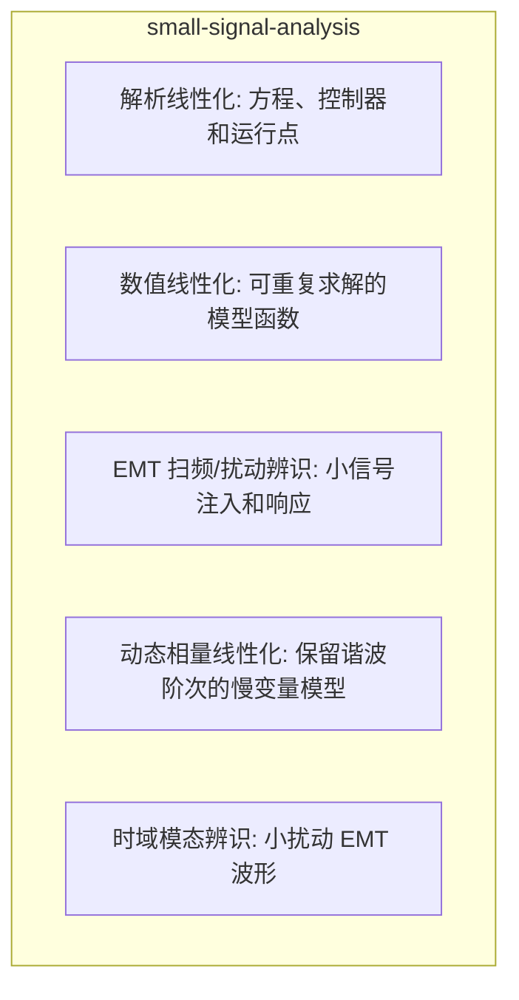

# 小信号分析方法 (Small-Signal Analysis)

## 定义与边界

小信号分析是在给定运行点附近对非线性动态系统线性化，并用状态空间、特征值、参与因子、频率响应或阻抗判据解释小扰动稳定性的技术路线。它的输入包括稳态运行点、状态变量、代数变量、控制器参数、网络等值和扰动输入；输出包括特征值、阻尼比、振荡频率、模态形状、参与因子和灵敏度。

本页关注 EMT 模型和电力电子/电网模型的小信号化方法，不替代 [[small-signal-stability]] 的稳定性主题页，也不替代 [[eigenvalue-analysis]]、[[state-space-method]] 或 [[impedance-measurement]] 的算法细节。小信号分析只解释运行点附近的小扰动；故障穿越、限流、闭锁、保护跳闸和大幅度开关事件需要 EMT 时域仿真单独验证。

## EMT 中的作用

在 EMT 语境中，小信号分析主要用于把时域波形中观察到的振荡、控制耦合和弱阻尼现象还原到模型结构：

- 对 VSC、MMC、LCC-HVDC、DFIG、PMSG 和储能变流器的控制环节进行线性化，识别 PLL、电流环、外环或环流控制参与的模态。
- 对 [[wideband-oscillation-stability]]、SSO、SSTI 和高频谐振问题提供频率、阻尼和参与变量解释。
- 用 EMT 小扰动注入、[[fft]] 或 [[prony-analysis]] 验证线性化预测的频率和阻尼是否与时域响应一致。
- 为参数整定、阻抗重塑和控制器带宽选择提供方向性证据。

若线性模型来自平均值模型或动态相量模型，应说明它保留了哪些频率分量，省略了哪些开关细节。若线性模型来自 EMT 黑箱量测，应说明注入幅值足够小，且没有触发限幅、死区或保护逻辑。

## 核心机制

对非线性系统：

$$\dot{x}=f(x,u), \quad y=g(x,u)$$

在运行点 $(x_0,u_0)$ 处满足 $f(x_0,u_0)=0$ 时，线性化得到：

$$\Delta \dot{x}=A\Delta x+B\Delta u, \quad \Delta y=C\Delta x+D\Delta u$$

其中：

$$A=\left.\frac{\partial f}{\partial x}\right|_{(x_0,u_0)}, \quad B=\left.\frac{\partial f}{\partial u}\right|_{(x_0,u_0)}$$

矩阵 $A$ 的特征值 $\lambda_i=\sigma_i+j\omega_i$ 用于判断小扰动响应。$\sigma_i<0$ 表示该线性模态衰减，$\sigma_i>0$ 表示线性模型预测增长；振荡频率为 $f_i=\omega_i/(2\pi)$。阻尼比可写为：

$$\zeta_i=\frac{-\sigma_i}{\sqrt{\sigma_i^2+\omega_i^2}}$$

参与因子常由左、右特征向量构成，用于提示哪些状态变量与某一模态关联更强。参与因子不是因果证明；它应与参数灵敏度、时域扰动或阻抗分析共同解释。

## 分类与变体

| 路线 | 输入 | 输出 | 典型用途 |
|------|------|------|----------|
| 解析线性化 | 方程、控制器和运行点 | 明确的 $A,B,C,D$ | 可解释性强的设备和控制模型 |
| 数值线性化 | 可重复求解的模型函数 | 近似雅可比矩阵 | 自编 EMT 或复杂模型快速线性化 |
| EMT 扫频/扰动辨识 | 小信号注入和响应 | 导纳、阻抗或频响 | 黑箱 IBR、厂商模型和 HIL |
| 动态相量线性化 | 保留谐波阶次的慢变量模型 | 多频耦合状态矩阵 | LCC、MMC 和谐波耦合研究 |
| 时域模态辨识 | 小扰动 EMT 波形 | 阻尼和频率估计 | 校核特征值结果或识别未知模态 |

## 适用边界与失败模式

- 扰动幅值必须足够小，不能触发电流限幅、PWM 饱和、保护逻辑、死区切换或控制模式切换。
- 运行点必须明确；同一控制器在不同短路比、功率方向、PLL 带宽和滤波器参数下可能得到不同模态。
- 线性化模型若省略开关频率、延时、采样保持或频率相关网络，可能低估高频或宽频振荡风险。
- 特征值阻尼比阈值不是普适合格线；是否可接受应由标准、项目要求、测量噪声和实际扰动持续时间决定。
- 用 EMT 波形拟合模态时，窗口太短会分辨不出低频阻尼，窗口太长又可能混入非线性控制和工况漂移。

## 代表性来源

| 来源 | 可支撑的内容 | 使用边界 |
|------|--------------|----------|
| [[2728一种用于lcc-hvdc系统小干扰稳定性分析的改进动态相量模型]] | LCC-HVDC 动态相量线性化和小扰动稳定分析入口 | 阶数、误差和算例结论应限定在原文系统 |
| [[an-automatable-approach-for-small-signal-stability-analysis-of-power-electronic-]] | 电力电子系统自动化小信号分析流程 | 需核查适用的软件接口和模型类别 |
| [[damping-of-subsynchronous-control-interactions-in-large-scale-pv-installations-t]] | 光伏弱网 SSCI 的特征值、FFT 和控制验证案例 | 结论受原文 PV/VSC 控制、FPGA 和测试系统约束 |
| [[analytical-model-building-for-type-3-wind-farm-subsynchronous-oscillation-analys]] | Type-3 风电场次同步振荡解析建模入口 | 不应外推到所有风电场聚合方式 |
| [[z-tool-frequency-domain-characterization-of-emt-models-for-small-signal-stabilit]] | EMT 模型频域表征和小信号稳定工具入口 | 工具能力、版本和接口需以原文/官方资料为准 |

## 与相关页面的关系

- [[state-space-method]] 提供状态空间表达；本页说明该表达如何用于小信号稳定解释。
- [[eigenvalue-analysis]] 关注特征值计算；本页强调 EMT 模型线性化和证据边界。
- [[impedance-measurement]] 与 [[frequency-scan]] 可用于黑箱模型或控制器端口的频域辨识。
- [[prony-analysis]] 和 [[fft]] 用于从 EMT 小扰动波形校核频率和阻尼。
- [[pll-model]]、[[vsc-model]]、[[mmc-model]]、[[dfig-model]] 和 [[synchronous-machine-model]] 是小信号模态常见参与对象。
- [[wideband-oscillation-stability]] 是应用主题页，汇总小信号、阻抗和 EMT 时域证据之间的关系。

## 来源论文

| 论文 | 年份 |
|------|------|
| [[a-parallel-multi-rate-electromagnetic-transient-simulation-algorithm-based-on-ne|基于传输线分网的并行多速率电磁暂态仿真算法]] | 2014 |
| [[analytical-model-building-for-type-3-wind-farm-subsynchronous-oscillation-analys|Analytical model building for Type-3 wind farm subsynchronou]] | 2021 |
| [[grid-forming-converters-sufficient-conditions-for-rms-modeling|Grid-forming converters: Sufficient conditions for RMS model]] | 2021 |
| [[mmc-hvdc系统高频稳定性分析与抑制策略(一)稳定性分析|High Frequency Stability Analysis and Suppression Strategy o]] | 2021 |
| [[characteristic-analysis-of-high-frequency-resonance-of-flexible-high-voltage-dir|Characteristic Analysis of High-frequency Resonance of Flexi]] | 2022 |
| [[an-automatable-approach-for-small-signal-stability-analysis-of-power-electronic-|An Automatable Approach for Small-Signal Stability Analysis ]] | 2023 |
| [[dq-admittance-model-extraction-for-ibrs-via-gaussian-pulse-excitation|DQ Admittance Model Extraction for IBRs via Gaussian Pulse E]] | 2023 |
| [[comprehensive-formula-omitted-impedance-modeling-of-ac-power-electronics-based-p|Comprehensive [formula omitted] impedance modeling of AC pow]] | 2024 |
| [[an-emt-based-dynamic-frequency-scanning-tool-for-stability-analysis-of-inverter-|An EMT based dynamic frequency scanning tool for stability a]] | 2025 |
| [[an-emt-based-dynamic-frequency-scanning-tool-for-stability-analysis-of-inverter-|An EMT based dynamic frequency scanning tool for stability a]] | 2025 |
| [[an-equivalent-dynamic-phasor-model-for-a-single-phase-boost-power-factor-correct|An Equivalent Dynamic Phasor Model for a Single-Phase Boost ]] | 2025 |
| [[fast-investigation-of-control-interaction-risks-in-pv-parks-using-eigenvalue-ana|Fast investigation of control interaction risks in PV parks ]] | 2025 |
| [[modeling-and-application-of-dq-sequence-dynamic-phasors-under-unbalanced-ac-cond|Modeling and application of DQ-sequence dynamic phasors unde]] | 2025 |
