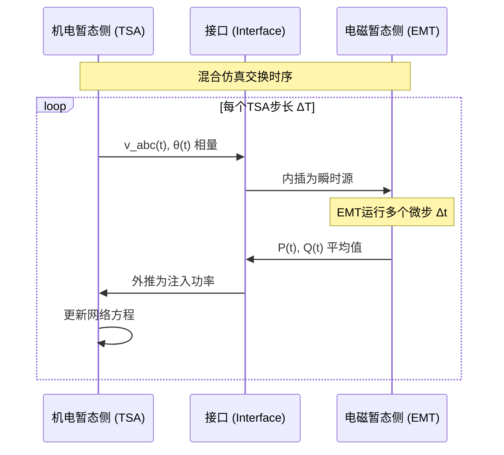

# 机电-电磁暂态混合仿真 (Electromechanical-Electromagnetic Hybrid Simulation)

## 定义与边界

机电-电磁暂态混合仿真把电力系统划分为机电暂态相量域和电磁暂态瞬时值域，并通过接口在同一仿真任务中交换边界信息。机电侧通常描述发电机转子、励磁、调速、负荷和大规模网络的基频动态；EMT 侧描述三相瞬时电压电流、开关、电力电子控制、非线性元件和快速故障暂态。

它是 [[hybrid-modeling]] 的专门形式，不等同于所有混合建模；它依赖 [[interface-technique]]，但接口技术本身还覆盖纯 EMT 分区、场路耦合和工具协同。

## EMT 中的作用

该方法用于研究“局部快速电磁过程会影响系统级慢动态，或系统级慢动态会改变局部 EMT 响应”的问题。例如 HVDC、FACTS、MMC、风电和光伏并网研究中，研究区可能需要 EMT 细节，而远端交流系统只需机电暂态表示。若研究目标只关心大系统功角稳定，可使用 [[electromechanical-simulation]]；若研究目标由开关、谐波、非对称故障或保护采样主导，应扩大 EMT 区域或使用全 EMT 验证。

## 域间变量转换

### 机电侧到 EMT 侧

机电侧输出通常是基频相量。接口需要把相量转换为 EMT 三相瞬时源：

$$
v_a(t) = \sqrt{2}|V|\cos(\omega t + \theta)
$$

$$
v_b(t) = \sqrt{2}|V|\cos(\omega t + \theta - 2\pi/3), \quad
v_c(t) = \sqrt{2}|V|\cos(\omega t + \theta + 2\pi/3)
$$

若存在负序、零序或频率偏移，应说明是否使用序分量、动态相量或 abc 相域接口。

### EMT 侧到机电侧

EMT 侧输出是瞬时波形。机电侧通常需要基频正序相量、功率或等效注入：

$$
\hat{V}_1(t_k) = \mathcal{P}\{v_a(t), v_b(t), v_c(t)\}
$$

其中 $\mathcal{P}$ 表示相量提取算子，可能是 DFT、dq 低通滤波、PLL 或动态相量估计。相量提取必须说明窗口长度、参考角、滤波延迟和不平衡处理。

## 接口等值

常见机电侧外部网络等值包括：

- Thevenin/Norton 基频等值：适合研究频带主要在基频附近、接口波形较平稳的场景。
- 多端口等值：保留多个接口母线之间的耦合。
- [[fdne-model]]：用频率相关导纳或阻抗表示外部网络宽频响应，适合接口处谐波或快速暂态不能忽略的场景。
- 动态相量接口：在相量域保留有限频带的调制分量，作为全 EMT 与传统机电模型之间的折中。

接口处至少应检查功率符号、电流方向、相量基准、基准容量和三相序分量定义。

## 多速率工作流

1. 初始化潮流，建立机电侧相量状态和 EMT 侧瞬时状态。
2. 根据研究对象选择接口母线和 EMT 详细区域。
3. 机电侧形成外部网络等值，EMT 侧把该等值实现为受控源、导纳或频率相关网络。
4. EMT 侧在多个小步长内推进，并记录接口电压电流。
5. 在机电交换时刻提取相量或功率，更新机电侧网络注入。
6. 机电侧推进一个或多个大步长，回传新的边界相量或等值参数。
7. 若采用并行或松耦合时序，使用预测、迭代或补偿检查接口功率偏差和相角延迟。

## 主要变体

- 串行混合仿真：实现简单，接口因果关系清晰，但存在数据等待和延迟。
- 并行混合仿真：适合实时或分布式计算，但需要预测校正和稳定性验证。
- 动态相量接口：在相量域保留部分非基频动态，减轻瞬时波形到基频相量的损失。
- FDNE 外部网络：保留外部系统频率响应，但需要拟合、无源性检查和时域实现。
- 模式切换混合仿真：扰动前后在相量、平均和 EMT 详细模型之间切换，必须处理状态一致性。

## 适用边界与失败模式

- 接口相量提取会引入窗口延迟，故障初期波形可能不能立即转化为可靠基频量。
- 基频等值不能表达超出其假设的谐波、行波或高频谐振。
- 非对称故障需要明确负序和零序如何在两侧传递。
- 接口位置过近可能把强畸变波形直接交给机电模型；接口位置过远会增加 EMT 区域规模。
- 并行时序和实时通信可能引入相角误差或能量不平衡。
- 机电侧控制、保护和限幅若与 EMT 侧实现不一致，混合结果可能由模型语义差异主导。

## 代表性证据与证据边界

该类论文常以具体 HVDC、VSC、MMC、SVC 或新能源接入算例验证接口策略。页面不应把单一算例中的误差、加速比、平台规模或实时性结果写成通用能力。任何数值结论都应绑定来源、系统规模、步长、接口位置、频带和对比基准。

可作为来源入口的页面包括 [[interfacing-techniques-for-transient-stability-and-electromagnetic-transient-hyb]]、[[frequency-dependent-network-equivalent-for-electromagnetic-and-electromechanical]]、[[dynamic-phasor-based-interface-model-for-emt-and-transient-stability-hybrid-simu]]、[[hybrid-transient-stability-simulation-using-dynamic-phasor-based-interface-model]] 和 [[application-of-electromagnetic-transient-transient-stability-hybrid-simulation-t]]。

## 与相关页面的关系

- [[hybrid-modeling]]：更一般的模型层级和物理域组合方法。
- [[interface-technique]]：接口变量、等值和时序的总览。
- [[fdne-model]]：机电侧外部网络的宽频等值模型。
- [[phasor-model]]：机电侧相量模型的基础。
- [[phase-domain-modeling]]：EMT 侧 abc 瞬时模型的基础。
- [[dq-transformation]]：相量提取和控制坐标变换常用工具。
- [[transient-stability]]：机电侧稳定性指标背景。

## 来源论文

| 论文 | 年份 |
|------|------|
| [[a-voltage-behind-reactance-synchronous-machine-model-for-the-emtp-type-solution|A Voltage-Behind-Reactance Synchronous Machine Model for the]] | 2006 |
| [[approximate-voltage-behind-reactance-induction-machine-model-for-efficient-inter|Approximate Voltage-Behind-Reactance Induction Machine Model]] | 2010 |
| [[including-magnetic-saturation-in-voltage-behind-reactance-induction-machine-mode|Including Magnetic Saturation in Voltage-Behind-Reactance In]] | 2010 |
| [[methods-of-interfacing-rotating-machine-models-in-emtp|Methods of Interfacing Rotating Machine Models in EMTP]] | 2010 |
| [[39pes20116039582|39/pes.2011.6039582]] | 2011 |
| [[frequency-dependent-network-equivalent-for-electromagnetic-and-electromechanical|Frequency Dependent Network Equivalent for Electromagnetic a]] | 2012 |
| [[comparison-between-electromechanical-transient-model-and-electromagnetic-transie|Comparison between electromechanical transient model and ele]] | 2013 |
| [[development-of-data-translators-for-interfacing-13&14|Development of Data Translators for Interfacing Power-Flow P]] | 2013 |
| [[multi-fpga-digital-hardware-design-iet-gtd|Multi-FPGA digital hardware design for detailed large-scale ]] | 2013 |
| [[fast-voltage-balancing-control-and-fast-19、20、21|Fast Voltage-Balancing Control and Fast]] | 2014 |
| [[fast-voltage-balancing-control-and-fast|Fast Voltage-Balancing Control and Fast Numerical Simulation]] | 2014 |
| [[parallel-massive-thread-electromagnetic-transient-simulation-on-gpu|Parallel Massive-Thread Electromagnetic Transient Simulation]] | 2014 |
| [[supplementary-techniques-for-2s-dirk-based-emt-simulations|Supplementary techniques for 2S-DIRK-based EMT simulations]] | 2014 |
| [[a-multi-domain-co-simulation-method-for-comprehensive-shifted-frequency-phasor-d|A Multi-Domain Co-Simulation Method for Comprehensive Shifte]] | 2019 |
| [[a-multi-domain-co-simulation-method-for-comprehensive-shifted-frequency-phasor-d|A Multi-Domain Co-Simulation Method for Comprehensive Shifte]] | 2019 |
| [[考虑换流器内部故障的lcc-hvdc动态平均化建模方法-13&14|考虑换流器内部故障的LCC-HVDC动态平均化建模方法]] | 2019 |
| [[a-harmonic-phasor-domain-co-simulation-method-and-new-insight-for-harmonic-analy|A Harmonic Phasor Domain Co-Simulation Method and New Insigh]] | 2020 |
| [[a-hierarchical-low-rank-approximation-based-network-solver-for-emt-simulation|A Hierarchical Low-Rank Approximation Based Network Solver f]] | 2020 |
| [[an-equivalent-hybrid-model-for-a-large-scale-modular-multilevel-converter-and-co|An Equivalent Hybrid Model for a Large-Scale Modular Multile]] | 2022 |
| [[co-simulation-applied-to-power-systems-with-high-penetration-of-distributed-ener|Co-simulation applied to power systems with high penetration]] | 2022 |
| [[direct-interfacing-of-parametric-average-value-models-of-acx2013dc-converters-fo|Direct Interfacing of Parametric Average-Value Models of AC&]] | 2022 |
| [[electromechanical-electromagnetic-hybrid-simulation-technology-with-large-number|Electromechanical-electromagnetic Hybrid Simulation Technolo]] | 2022 |
| [[electromechanical-electromagnetic-hybrid-simulation-technology-with-large-number|Electromechanical-electromagnetic Hybrid Simulation Technolo]] | 2022 |
| [[electromechanical-electromagnetic-transient-hybrid-simulation-of-an-acdc-hybrid-|Electromechanical-electromagnetic transient hybrid simulatio]] | 2022 |
| [[机电电磁暂态混合仿真多端口模型的比较分析|机电—电磁暂态混合仿真多端口模型的比较分析]] | 2022 |
| [[an-efficient-half-bridge-mmc-model-for-emtp-type-simulation-based-on-hybrid-nume|An Efficient Half-Bridge MMC Model for EMTP-Type Simulation ]] | 2023 |
| [[average-value-model-for-voltage-source-converters-with-direct-interfacing-in-emt|Average-Value Model for Voltage-Source Converters With Direc]] | 2023 |
| [[fast-detection-method-of-commutation-failure-based-on-multi-infeed-interaction-f|Fast Detection Method of Commutation Failure Based on Multi-]] | 2023 |
| [[fast-detection-method-of-commutation-failure-based-on-multi-infeed-interaction-f|Fast Detection Method of Commutation Failure Based on Multi-]] | 2023 |
| [[loop-closing-analytical-calculation-system-based-on-electromagnetic-electromecha|Loop closing analytical calculation system based on electrom]] | 2023 |
| [[numerically-efficient-average-value-model-for-voltage-source-converters-in-nodal|Numerically Efficient Average-Value Model for Voltage-Source]] | 2024 |
| [[考虑死区特性的全桥型mmc状态空间平均化建模方法|考虑死区特性的全桥型MMC状态空间平均化建模方法]] | 2024 |
| [[acceleration-strategies-for-emt-simulation-of-hvdc-systems|Acceleration strategies for EMT Simulation of HVDC systems]] | 2025 |
| [[co-simulation-and-compensation-method-for-parallel-simulation-of-electromagnetic|Co-simulation and compensation method for parallel simulatio]] | 2025 |
| [[基于单机模型扩展的直驱风电场通用等值模型构建方法|基于单机模型扩展的直驱风电场通用等值模型构建方法]] | 2025 |
| [[大规模交直流电网电磁暂态数模混合仿真平台构建及验证-40|大规模交直流电网电磁暂态数模混合仿真平台构建及验证]] | 2025 |
| [[electromechanical-transientelectromagnetic-transient-hybrid-simulation-method-co|Electromechanical transientelectromagnetic transient hybrid ]] | 2026 |
| [[experimental-research-on-high-voltage-transformer-transient-characteristics|Experimental research on high-voltage transformer transient ]] | 2026 |
| [[nuclear-powered-hybrid-energy-system-for-clean-hydrogen-production-time-step-opt|Nuclear-Powered Hybrid Energy System for Clean Hydrogen Prod]] | 2026 |
| [[大电网仿真工具现状及其在华北电网推广应用的思考|大电网仿真工具现状及其在华北电网推广应用的思考]] | 未知 |
| [[大电网仿真工具现状及其在华北电网推广应用的思考|大电网仿真工具现状及其在华北电网推广应用的思考]] | 未知 |
| [[大电网仿真工具现状及其在华北电网推广应用的思考|大电网仿真工具现状及其在华北电网推广应用的思考]] | 未知 |
| [[大电网仿真工具现状及其在华北电网推广应用的思考|大电网仿真工具现状及其在华北电网推广应用的思考]] | 未知 |
| [[大电网仿真工具现状及其在华北电网推广应用的思考|大电网仿真工具现状及其在华北电网推广应用的思考]] | 未知 |
| [[大电网仿真工具现状及其在华北电网推广应用的思考|大电网仿真工具现状及其在华北电网推广应用的思考]] | 未知 |
| [[电力系统电磁暂态仿真igbt详细建模及应用|电力系统电磁暂态仿真IGBT详细建模及应用]] | 未知 |