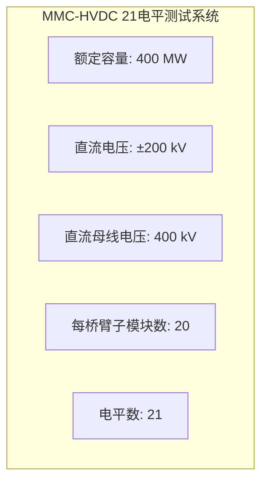

# MMC-HVDC 21电平测试系统





## 概述

21电平模块化多电平换流器高压直流输电（MMC-HVDC）系统是学术研究中最常用的中等规模MMC测试系统。该系统凭借其适中的模型复杂度和良好的计算效率，成为验证MMC建模方法、测试控制策略、评估仿真算法的标准测试平台。

**系统特点**:
- **中等规模**: 每桥臂20个子模块，既保持了MMC的基本特性，又避免了大规模系统的高计算负担
- **典型拓扑**: 采用双端点对点或背靠背结构，覆盖主流MMC-HVDC应用场景
- **广泛应用**: 被数百篇学术论文用作验证案例，具有高度的可比性和参考价值
- **标准参数**: 已形成学术界普遍认可的典型参数集，便于不同研究间的横向比较

**应用领域**:
- MMC电磁暂态建模方法验证
- 平均值模型与详细模型对比
- 戴维南等效模型精度评估
- 实时仿真算法性能测试
- 新型控制策略效果评估
- 故障穿越特性研究

## 系统参数

### 额定参数

**基本电气参数**:
| 参数 | 典型值 | 范围 | 说明 |
|------|--------|------|------|
| 额定容量 | 400 MW | 300-500 MW | 单端额定功率 |
| 直流电压 | ±200 kV | ±150-±350 kV | 极对地电压 |
| 直流母线电压 | 400 kV | 300-700 kV | 极间电压 |
| 每桥臂子模块数 | 20 | 20-40 | 21电平输出 |
| 电平数 | 21 | 21-41 | 含零电平 |

**拓扑结构**:
- **换流器类型**: 三相模块化多电平换流器
- **桥臂结构**: 上下桥臂对称结构
- **子模块类型**: 半桥子模块（Half-Bridge SM, HBSM）
- **相单元结构**: 上下桥臂串联，中间点连接交流侧
- **直流侧结构**: 双极性结构，正负极对称

**运行模式**:
- **点对点传输**: 两端分别连接不同交流电网
- **背靠背结构**: 两端位于同一地点，实现异步电网互联
- **功率方向**: 可双向运行，整流/逆变状态可切换

### MMC换流器参数

**桥臂参数**:
| 参数 | 典型值 | 说明 |
|------|--------|------|
| 桥臂电感 | 50-100 mH | 抑制环流和故障电流 |
| 桥臂电阻 | 0.1-0.5 Ω | 等效损耗电阻 |
| 桥臂子模块数 | 20 | 每桥臂串联数量 |

**子模块配置**:
- **电容电压额定值**: 10-20 kV
- **子模块电容**: 5-15 mF
- **开关器件**: IGBT（绝缘栅双极型晶体管）
- **反并联二极管**: 与IGBT集成
- **投切方式**: 全桥或半桥拓扑

**电平数计算**:
```
电平数 = 2N + 1
其中N为每桥臂子模块数

对于21电平系统:
N = 10子模块/桥臂（上下桥臂各10个）
或
N = 20子模块/桥臂（单桥臂20个）
```

## 交流系统参数

### 交流侧额定参数

**交流电网参数**:
| 参数 | 典型值 | 范围 | 说明 |
|------|--------|------|------|
| 交流电压 | 220 kV | 110-330 kV | 线电压有效值 |
| 额定频率 | 50 Hz | 50/60 Hz | 中国/国际标准 |
| 基准容量 | 400 MVA | 300-500 MVA | 与直流侧匹配 |

**交流系统等效参数**:
| 参数 | 典型值 | 说明 |
|------|--------|------|
| 等效电感 | 2.5-5 mH | 系统短路容量等效 |
| 等效电阻 | 0.05-0.2 Ω | 线路及变压器电阻 |
| 短路比(SCR) | 2.5-5 | 短路容量/换流器容量 |
| X/R比 | 5-10 | 电抗/电阻比 |

### 交流系统强度

**短路比(SCR)定义**:
```
SCR = Ssc / Pdc

其中:
Ssc = 交流母线短路容量(MVA)
Pdc = MMC-HVDC额定功率(MW)
```

**系统强度分类**:
| SCR范围 | 系统强度 | 特性 |
|---------|----------|------|
| SCR > 5 | 强系统 | 电压支撑能力强 |
| 2 < SCR < 5 | 中等强度 | 典型应用场景 |
| SCR < 2 | 弱系统 | 需要额外电压支撑 |

**典型应用场景**:
- **强系统(SCR>5)**: 城市负荷中心接入
- **中等强度(SCR=2.5-5)**: 远距离输电终端
- **弱系统(SCR<2)**: 海上风电送出，需配置STATCOM

### 变压器参数

**换流变压器**:
| 参数 | 典型值 | 说明 |
|------|--------|------|
| 额定容量 | 420 MVA | 略大于换流器容量 |
| 变比 | 220/200 kV | 网侧/阀侧 |
| 短路阻抗 | 12-18% | 典型值15% |
| 接线方式 | YNd11或YNy0 | 相位匹配 |

**变压器作用**:
- 电压等级变换，匹配电网与换流器
- 提供电气隔离，抑制零序分量
- 限制故障电流，保护换流器
- 实现相位控制，优化功率传输

## 子模块参数

### 半桥子模块结构

**电路拓扑**:
```
        IGBT1(上管)
      ┌───┐
   ───┤ T1├──┬─── 输出正端
      └───┘  │
             ├─ C (电容)
      ┌───┐  │
   ───┤ T2├──┴─── 输出负端
      └───┘
     IGBT2(下管)
```

**工作模式**:
| T1 | T2 | 输出电压 | 状态 |
|----|----|----------|------|
| 开 | 关 | Vc | 投入状态 |
| 关 | 开 | 0 | 旁路状态 |
| 关 | 关 | - | 闭锁状态(故障) |

### 子模块电气参数

**电容参数**:
| 参数 | 典型值 | 范围 | 说明 |
|------|--------|------|------|
| 额定电容电压 | 10-20 kV | 10-25 kV | 子模块额定电压 |
| 子模块电容 | 8-12 mF | 5-15 mF | 储能电容 |
| 电容储能 | 0.5-2 MJ | - | 总储能量 |
| 电压纹波 | <10% | 5-15% | 额定电压百分比 |

**开关器件参数**:
| 参数 | 典型值 | 说明 |
|------|--------|------|
| 器件类型 | IGBT | 绝缘栅双极型晶体管 |
| 额定电压 | 3.3-6.5 kV | 单个IGBT耐压 |
| 额定电流 | 1-2 kA | 连续工作电流 |
| 开关频率 | 100-300 Hz | 等效开关频率 |

**器件串联**:
- 实际应用中，多个IGBT串联以满足高电压需求
- 典型配置: 4-6个3.3kV IGBT串联
- 需要静态/动态均压电路
- 门极驱动同步控制

### 子模块均压控制

**均压目标**:
- 各子模块电容电压均衡
- 电压偏差控制在±5%以内
- 快速响应负载变化

**均压策略**:
1. **排序法**: 根据电压排序选择投入子模块
2. **载波移相法**: 各子模块载波相位错开
3. **电压闭环控制**: 基于电压偏差的PI控制

## 控制系统

### 控制系统架构

**分层控制结构**:
```
系统级控制
    │
    ├── 站级控制
    │       ├── 有功/无功控制
    │       └── 直流电压控制
    │
    └── 阀级控制
            ├── 外环控制
            ├── 内环控制
            ├── 环流抑制
            └── 电容电压平衡
```

**控制层级**:
| 层级 | 响应时间 | 带宽 | 功能 |
|------|----------|------|------|
| 系统级 | 100ms-1s | <10 Hz | 功率调度、模式切换 |
| 站级 | 10-100ms | 10-50 Hz | 外环功率控制 |
| 阀级 | 1-10ms | 100-500 Hz | 电流内环、调制 |
| 子模块级 | <1ms | >1 kHz | 均压、保护 |

### 外环控制

**控制模式**:

**模式1: 有功/无功控制(P-Q控制)**:
- 有功功率设定值控制
- 无功功率独立控制
- 适用于功率传输场景

**模式2: 直流电压/无功控制(Vdc-Q控制)**:
- 直流电压稳定控制
- 一端控电压，一端控功率
- 适用于直流电网电压支撑

**模式3: 交流电压/频率控制(Vac-f控制)**:
- 交流电压幅值控制
- 频率支撑控制
- 适用于孤岛运行或弱系统

**外环PI控制器**:
```
Pref = Kp*(Pset - Pmeas) + Ki*∫(Pset - Pmeas)dt
Qref = Kp*(Qset - Qmeas) + Ki*∫(Qset - Qmeas)dt

典型参数:
Kp = 0.5-2
Ki = 5-20
```

### 内环控制

**d-q坐标系电流控制**:

**坐标变换**:
- 三相静止坐标系(abc) → 两相同步旋转坐标系(dq)
- 锁相环(PLL)获取电网电压相位
- d轴与电网电压矢量对齐

**电流解耦控制**:
```
d轴电流(有功分量):
Vd_ref = Kp*(Id_ref - Id) + Ki*∫(Id_ref - Id)dt - ωL*Iq + Vd_grid

q轴电流(无功分量):
Vq_ref = Kp*(Iq_ref - Iq) + Ki*∫(Iq_ref - Iq)dt + ωL*Id + Vq_grid

其中:
ω = 2πf (角频率)
L = 桥臂电感 + 变压器漏感
```

**内环PI参数**:
| 参数 | 典型值 | 说明 |
|------|--------|------|
| Kp | 0.5-2 | 比例增益 |
| Ki | 50-200 | 积分增益 |
| 带宽 | 200-500 Hz | 电流环响应速度 |

### 环流抑制控制

**环流产生机理**:
- 三相桥臂电压不平衡
- 子模块电容电压波动
- 引起相间环流(主要为二次谐波)

**环流特性**:
- 频率: 主要为100Hz(2倍基频)
- 路径: 三相桥臂内部环流
- 影响: 增加器件电流应力、损耗

**抑制策略**:

**1. 双坐标系法**:
- 正序坐标系(dq+)
- 负序坐标系(dq-)
- 分别控制正负序分量

**2. PR控制器法**:
- 比例谐振控制器
- 针对100Hz谐振频率
- 高增益抑制特定频率

**3. 载波调制优化**:
- 载波移相优化
- 注入零序电压
- 从调制层面抑制环流

### 电容电压平衡控制

**平衡控制层次**:

**相内平衡(Phase Balancing)**:
- 目标: 三相总电容电压均衡
- 方法: 注入零序电压或调整调制比
- 时间尺度: 10-100ms

**桥臂内平衡(Arm Balancing)**:
- 目标: 上下桥臂电压均衡
- 方法: 调整上下桥臂调制波
- 时间尺度: 1-10ms

**子模块级平衡(SM Balancing)**:
- 目标: 各子模块电容电压均衡
- 方法: 排序法选择投入子模块
- 时间尺度: <1ms

**排序法原理**:
1. 采样所有子模块电容电压
2. 按电压值排序
3. 桥臂电流正向时，优先投入电压低的子模块
4. 桥臂电流负向时，优先投入电压高的子模块
5. 实现电容充放电平衡

### 调制策略

**最近电平逼近调制(NLM)**:
- 计算目标电平数
- 选择最接近的电平
- 适用于高电平数MMC

**载波移相调制(CPS-PWM)**:
- 各子模块载波相位错开2π/N
- 等效开关频率提高N倍
- 适用于中等电平数MMC

**21电平系统推荐**:
- 采用NLM + 排序法
- 开关频率约150Hz
- 谐波特性良好

## 典型测试场景

### 稳态运行测试

**测试目的**:
- 验证系统稳态特性
- 评估电容电压波动
- 检验控制稳态精度

**测试条件**:
| 参数 | 设置值 |
|------|--------|
| 有功功率 | 200-400 MW |
| 无功功率 | 0-100 Mvar |
| 直流电压 | 额定400 kV |
| 运行时间 | >5秒 |

**评估指标**:
- 电容电压波动幅度: <10%
- 桥臂电流THD: <5%
- 功率控制精度: ±1%
- 系统损耗: <2%

### 有功功率阶跃

**测试目的**:
- 评估功率响应速度
- 验证动态稳定性
- 检验控制性能

**测试步骤**:
1. 系统稳态运行于50%功率(200 MW)
2. t=1s时，功率阶跃至100%功率(400 MW)
3. t=3s时，功率阶跃回50%功率
4. 记录过渡过程

**典型响应特性**:
| 参数 | 期望值 | 说明 |
|------|--------|------|
| 响应时间 | 20-50 ms | 90%稳态值 |
| 超调量 | <10% | 功率过冲 |
| 调节时间 | 100-200 ms | 进入±5%带 |
| 电压跌落 | <5% | 交流电压 |

**波形特征**:
- 功率平滑过渡
- 电容电压瞬时波动后恢复
- 桥臂电流平滑变化
- 无振荡失稳

### 无功功率阶跃

**测试目的**:
- 验证无功独立控制能力
- 评估电压支撑响应
- 检验控制解耦效果

**测试步骤**:
1. 稳态运行(P=200 MW, Q=0)
2. t=1s时，无功阶跃至感性100 Mvar
3. t=3s时，无功阶跃至容性100 Mvar
4. t=5s时，无功恢复至0

**评估指标**:
- 响应时间: 10-30 ms
- 功率解耦: 有功波动<5%
- 电压变化: 幅值变化<3%

### 直流故障测试

**测试目的**:
- 评估故障穿越能力
- 验证保护动作
- 检验故障恢复

**故障类型**:

**1. 直流单极接地故障**:
- 正极或负极接地
- 故障电阻: 0-10 Ω
- 持续时间: 100-500 ms

**2. 直流极间短路**:
- 正负极短接
- 最严重故障类型
- 需快速闭锁保护

**3. 直流断线故障**:
- 直流线路断开
- 能量无法传输
- 系统降功率运行

**保护策略**:
1. 故障检测: 直流电压突降/过流
2. 换流器闭锁: IGBT关断
3. 交流侧跳闸: 断路器动作
4. 故障清除: 直流断路器或去游离
5. 系统重启: 恢复送电

**测试评估**:
- 故障检测时间: <5 ms
- 保护动作时间: <10 ms
- 过流抑制: <2倍额定
- 恢复时间: 100-500 ms

### 交流故障测试

**测试目的**:
- 验证交流故障穿越能力
- 评估低电压穿越(LVRT)性能
- 检验控制鲁棒性

**故障类型**:

**1. 三相短路故障**:
- 电压跌落至20-50%
- 持续时间: 100-625 ms
- 最严重对称故障

**2. 单相接地故障**:
- 单相电压跌落
- 持续时间: 100-500 ms
- 最常见故障类型

**3. 两相短路故障**:
- 相间短路
- 不对称故障
- 负序分量产生

**LVRT要求**:
| 电压跌落 | 持续时间 | 要求 |
|----------|----------|------|
| >90% | 连续 | 正常运行 |
| 90-50% | 2s | 保持连接 |
| 50-20% | 0.6-2s | 低电压穿越 |
| <20% | <0.15s | 允许脱网 |

**控制响应**:
1. 故障期间: 注入无功支撑电网
2. 有功限流: 防止过电流
3. 故障清除: 快速恢复功率
4. 电压恢复: 支撑电网重建

### 启动充电过程

**测试目的**:
- 验证启动策略
- 评估充电过程
- 检验时序控制

**充电阶段**:

**阶段1: 不控充电**:
- 交流侧断路器闭合
- 通过二极管整流充电
- 电容电压逐步建立
- 各子模块电压不均衡

**阶段2: 均压控制启动**:
- 解锁换流器控制
- 启动均压排序算法
- 平衡各子模块电压
- 目标: 电压偏差<5%

**阶段3: 升压控制**:
- 逐步提升直流电压
- 斜率控制防止过冲
- 最终达到额定电压

**阶段4: 功率传输**:
- 直流电压稳定
- 功率参考值逐步增加
- 进入正常运行

**充电特性**:
- 充电时间: 200-500 ms
- 充电电流: 限制在额定值内
- 电压过冲: <10%
- 均压时间: 100-300 ms

## 研究应用

### MMC建模方法验证

**验证目标**:
- 评估不同建模方法的精度和效率
- 为大规模仿真提供模型选择依据
- 建立模型准确度基准

**对比模型类型**:

**1. 详细开关模型**:
- 每个IGBT、二极管详细建模
- 最高精度，最慢速度
- 作为精度基准

**2. 戴维南等效模型**:
- 子模块等效为电压源+电阻
- 精度接近详细模型
- 速度提升10-100倍

**3. 平均值模型**:
- 桥臂等效为受控电压源
- 忽略高频开关细节
- 速度最快，适合系统级研究

**验证指标**:
| 指标 | 详细模型 | 戴维南等效 | 平均值模型 |
|------|----------|------------|------------|
| 波形精度 | 100% | 95-99% | 85-95% |
| 谐波细节 | 完整 | 部分 | 忽略 |
| 计算速度 | 1x | 10-50x | 100-500x |
| 适用场景 | 器件级 | 阀级 | 系统级 |

### 平均值模型对比

**对比维度**:

**1. 桥臂平均值模型**:
- 建模方法: 桥臂整体等效
- 优势: 简单高效
- 局限: 无法分析子模块级现象

**2. 开关函数模型**:
- 建模方法: 基于开关函数
- 优势: 保留调制信息
- 局限: 计算量中等

**3. 受控源等效模型**:
- 建模方法: 受控电压/电流源
- 优势: 接口灵活
- 局限: 需考虑接口稳定性

**对比测试场景**:
- 稳态波形对比
- 阶跃响应对比
- 故障穿越对比
- 计算效率对比

### 仿真算法加速测试

**测试目标**:
- 评估实时仿真可行性
- 验证加速算法效果
- 确定最大可仿真规模

**加速技术**:

**1. 多速率仿真**:
- 不同部分采用不同步长
- 电力电子用小步长(1-10 μs)
- 交流网络用大步长(50-100 μs)

**2. 并行计算**:
- GPU加速
- 多核CPU并行
- 分布式仿真

**3. 模型降阶**:
- 保留主导动态
- 忽略高频细节
- 状态空间降阶

**性能评估**:
| 算法 | 加速比 | 精度损失 | 实时性 |
|------|--------|----------|--------|
| CPU串行 | 1x | 0% | 否 |
| 多核并行 | 4-8x | 0% | 部分 |
| GPU加速 | 10-50x | <1% | 是 |
| 多速率 | 5-10x | <2% | 是 |

### 控制策略评估

**评估内容**:

**1. 环流抑制效果**:
- 不同控制策略对比
- 环流抑制率: 目标>80%
- 计算开销评估

**2. 均压控制性能**:
- 排序法 vs 载波法
- 电压平衡度: 目标<5%
- 开关频率影响

**3. 故障穿越控制**:
- LVRT策略对比
- 无功支撑能力
- 恢复特性

**评估方法**:
- 仿真对比测试
- 性能指标量化
- 鲁棒性分析
- 工程适用性评价

## 仿真设置

### 仿真平台

**主流仿真工具**:

**1. PSCAD/EMTDC**:
- 专业电力系统EMT仿真
- 丰富的MMC模型库
- 图形化建模界面
- 工业标准工具

**2. MATLAB/Simulink**:
- 灵活的建模能力
- 丰富的工具箱支持
- 易于算法开发
- 学术常用平台

**3. RT-LAB/RTDS**:
- 实时仿真平台
- 硬件在环测试
- 工业级精度
- 控制验证首选

**4. 自定义平台**:
- 基于Python/C++开发
- 算法研究专用
- 灵活可定制
- 开源实现

### 仿真参数设置

**时间参数**:
| 参数 | 推荐值 | 说明 |
|------|--------|------|
| 仿真步长 | 10-50 μs | 开关周期1/100-1/20 |
| 仿真时长 | 5-10 s | 覆盖暂态过程 |
| 输出步长 | 0.1-1 ms | 数据存储间隔 |

**数值方法**:
- 积分算法: 梯形法或后向欧拉法
- 开关处理: 插值法精确捕捉
- 代数环: 迭代求解
- 收敛精度: 1e-6

**模型设置**:
- IGBT模型: 理想开关或开关函数
- 二极管模型: 理想或指数模型
- 电容模型: 理想电容或ESR模型
- 线路模型: 集中参数或分布参数

### 仿真案例配置

**基础案例配置**:
```
系统: 21电平MMC-HVDC
容量: 400 MW
直流电压: ±200 kV
子模块数: 20/桥臂
仿真步长: 20 μs
仿真时长: 5 s
```

**计算资源需求**:
| 规模 | CPU核心 | 内存 | 预估耗时 |
|------|---------|------|----------|
| 单端 | 4核 | 8GB | 30-60分钟 |
| 双端 | 8核 | 16GB | 1-2小时 |
| 实时要求 | 专用硬件 | - | 1:1实时 |

## 性能指标

### 电容电压波动

**波动来源**:
- 功率波动引起能量交换
- 二倍频环流注入
- 基频电流充放电

**波动指标**:
| 指标 | 定义 | 典型值 | 限值 |
|------|------|--------|------|
| 峰峰值波动 | ΔV_pp / V_nom | 5-10% | <15% |
| 有效值波动 | ΔV_rms / V_nom | 3-6% | <10% |
| 不平衡度 | (V_max-V_min)/V_avg | 2-5% | <10% |

**影响因素**:
- 电容容量: 容量越大，波动越小
- 开关频率: 频率越高，波动越小
- 控制策略: 均压效果影响不平衡度
- 运行工况: 功率越大，波动越大

### 桥臂电流波形

**电流组成**:
```
I_arm = I_dc/3 + I_ac/2 + I_circ

其中:
I_dc: 直流分量
I_ac: 交流分量(50Hz)
I_circ: 环流分量(100Hz)
```

**波形质量指标**:
| 指标 | 定义 | 目标值 |
|------|------|--------|
| THD | 总谐波畸变率 | <5% |
| 峰值电流 | Imax / Inom | <1.5 |
| 电流不平衡 | 三相电流差 | <5% |

**谐波特性**:
- 基频(50Hz): 主导分量
- 2次谐波(100Hz): 环流分量
- 开关频率附近: 调制谐波

### 功率响应时间

**响应时间定义**:
- 上升时间: 10%→90%稳态值
- 调节时间: 进入±5%带
- 超调量: 最大过冲百分比

**典型指标**:
| 工况 | 上升时间 | 调节时间 | 超调量 |
|------|----------|----------|--------|
| 有功阶跃 | 20-50 ms | 100-200 ms | <10% |
| 无功阶跃 | 10-30 ms | 50-100 ms | <5% |
| 故障恢复 | 50-100 ms | 200-500 ms | <15% |

**影响因素**:
- 控制带宽: 带宽越高，响应越快
- 系统惯性: 电容储能影响响应
- 控制参数: PI参数优化
- 限幅设置: 电流限幅制约响应

### 计算耗时对比

**耗时分析**:

**详细开关模型**:
- 单步计算: 10-50 ms
- 1秒仿真: 10-50分钟
- 主要开销: 开关事件处理

**戴维南等效模型**:
- 单步计算: 0.5-2 ms
- 1秒仿真: 30秒-2分钟
- 主要开销: 矩阵求解

**平均值模型**:
- 单步计算: 0.1-0.5 ms
- 1秒仿真: 5-20秒
- 主要开销: 控制算法

**加速效果汇总**:
| 模型 | 相对耗时 | 加速比 |
|------|----------|--------|
| 详细模型 | 100% | 1x |
| 戴维南等效 | 5-10% | 10-20x |
| 平均值模型 | 1-2% | 50-100x |

## 相关页面

### 相关测试系统
- [[cigre-hvdc-benchmark]] - CIGRE HVDC基准模型
- [[ieee-39-bus-system]] - IEEE 39节点系统
- [[ieee-118-bus-system]] - IEEE 118节点系统
- [[nordic-32-system]] - Nordic 32系统

### 相关模型页
- [[mmc-model]] - MMC模型
- [[vsc-model]] - VSC模型
- [[lcc-model]] - LCC模型
- [[fdne-model]] - FDNE模型

### 相关方法页
- [[average-value-model]] - 平均值模型
- [[vector-fitting]] - 矢量拟合
- [[nodal-analysis]] - 节点分析
- [[fixed-admittance]] - 恒导纳模型
- [[multirate-method]] - 多速率方法

### 相关主题页
- [[co-simulation]] - 混合仿真
- [[real-time-simulation]] - 实时仿真
- [[vsc-hvdc]] - VSC-HVDC

## 参考文献

1. Marquardt, R., "Modular Multilevel Converter: An universal concept for HVDC-Networks and extended DC-Bus-applications", IPEMC 2010
2. Saad, H., et al., "Modular Multilevel Converter Models for Electromagnetic Transient Studies", IEEE Trans. Power Delivery, 2014
3. Gnanarathna, U.N., et al., "Efficient Modeling of Modular Multilevel HVDC Converters (MMC) on Electromagnetic Transient Simulation Programs", IEEE Trans. Power Delivery, 2011
4. Negra, N.B., et al., "Pole-to-Pole Short-Circuits in a Conventional MMC-HVDC Link", IEEE Trans. Power Delivery, 2016
5. Li, X., et al., "Analyze the Steady-State and Dynamic Characteristics of the MMC-HVDC System Based on the Improved Average Value Model", IEEE Access, 2019
6. Bergna, G., et al., "A Generalized Power Control Approach in ABC Frame for Modular Multilevel Converter HVDC Links Based on Phase-Locked Loop", IEEE Trans. Power Electronics, 2016
7. Song, Q., et al., "Steady-State and Dynamic Models of the MMC-HVDC System for Simulation and Analysis", IEEE Trans. Power Delivery, 2016
8. Lesnicar, A., & Marquardt, R., "An Innovative Modular Multilevel Converter Topology Suitable for a Wide Power Range", IEEE Bologna PowerTech, 2003
9. Solas, E., et al., "Modeling, Simulation and Control of Modular Multilevel Converter", IEEE Trans. Power Electronics, 2013
10. Tu, Q., et al., "Reduced Switching-Frequency Modulation and Circulating Current Suppression for Modular Multilevel Converters", IEEE Trans. Power Delivery, 2011

## 来源论文

见[[index]]中MMC-HVDC及21电平测试系统相关文献。
