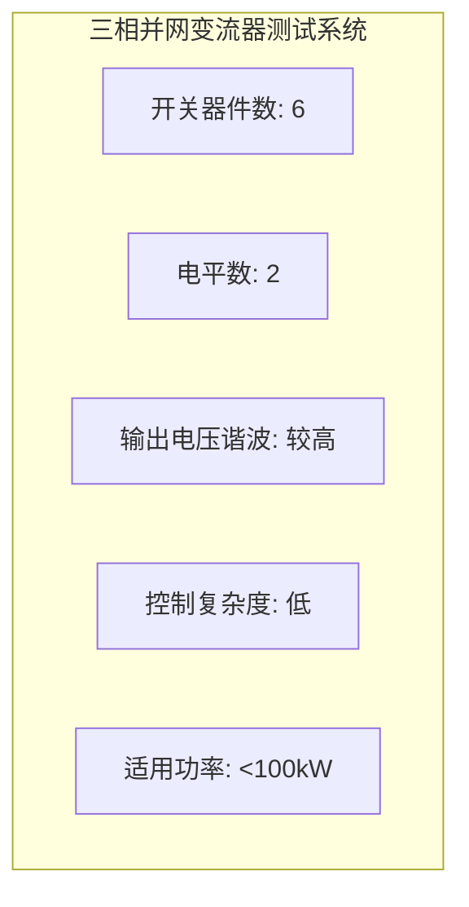

# 三相并网变流器测试系统





## 概述

三相并网变流器(Three-Phase Grid-Connected Converter)是新能源并网的核心电力电子设备，广泛应用于光伏发电、风力发电、储能系统和电动汽车充电等领域。作为连接直流侧电源与交流电网的桥梁，变流器通过功率半导体器件的高频开关实现交直流电能转换和功率双向流动控制。在EMT(Electromagnetic Transient)仿真研究中，三相并网变流器测试系统是验证控制策略、分析谐波特性和评估系统稳定性的基础实验平台。通过精确建模变流器拓扑、PWM调制算法和控制系统，研究人员能够深入理解并网变流器在各种工况下的动态响应行为，为新能源大规模并网提供理论支撑和技术保障。

## 系统特点

### 应用背景

**新能源并网核心设备**:
- 光伏逆变器: 将光伏组件直流电转换为交流电并网
- 风电变流器: 实现双馈感应发电机和永磁同步发电机的功率变换
- 储能变流器: 实现电池储能与电网间的双向能量流动
- 电动汽车充电桩: 车载充电器和地面充电桩的核心部件

**技术发展驱动**:
- 高比例可再生能源接入需求
- 智能电网和微电网技术发展
- 电力电子化电力系统转型
- 电能质量和电网稳定性要求提升

### 仿真研究价值

**控制策略验证**:
- 矢量控制算法性能评估
- 锁相环动态响应测试
- 电网适应性和抗扰动能力
- 故障穿越能力验证

**电能质量分析**:
- 谐波产生机理和传播特性
- 滤波器设计优化
- 网侧电流THD评估
- 功率因数调节性能

**稳定性研究**:
- 小信号稳定性分析
- 阻抗建模和稳定性判据
- 多机并联稳定性
- 电网强弱适应性

## 拓扑结构

### 两电平拓扑

**基本结构**:
- 三相全桥电路，每相由两个功率开关组成
- 共6个开关器件(IGBT/SiC MOSFET)
- 每相输出电平: 正、负(两种电平)
- 直流母线电容支撑电压

**技术特点**:
| 参数 | 典型值 | 说明 |
|------|--------|------|
| 开关器件数 | 6 | 三相桥臂 |
| 电平数 | 2 | 正/负母线电压 |
| 输出电压谐波 | 较高 | 需滤波器抑制 |
| 控制复杂度 | 低 | 结构简单 |
| 适用功率 | <100kW | 中小功率应用 |

**优缺点分析**:
- **优点**: 结构简单、控制容易、成本低、可靠性高
- **缺点**: 输出电压谐波含量高、开关频率受限、du/dt较大

### 三电平NPC拓扑

**基本结构**:
- Neutral Point Clamped(NPC)中性点箝位拓扑
- 每相4个开关器件+2个箝位二极管
- 共12个开关器件+6个箝位二极管
- 每相输出电平: 正、零、负(三种电平)

**技术特点**:
| 参数 | 典型值 | 说明 |
|------|--------|------|
| 开关器件数 | 12 | 三相桥臂 |
| 箝位二极管 | 6 | 中性点箝位 |
| 电平数 | 3 | 正/零/负母线电压 |
| 输出dv/dt | 较低 | EMI特性改善 |
| 适用功率 | 100kW-1MW | 中大功率应用 |

**优缺点分析**:
- **优点**: 输出电压谐波低、器件耐压要求低一半、du/dt小、EMI低
- **缺点**: 器件数量多、直流侧电容电压平衡复杂、箝位二极管损耗

**电容电压平衡问题**:
- 中点电位漂移机理
- 冗余开关状态利用
- 零序电压注入控制
- 辅助平衡电路设计

### T型三电平拓扑

**基本结构**:
- T型结构每相4个开关器件
- 共12个开关器件，无箝位二极管
- 双向开关连接至直流侧中点
- 每相输出电平: 正、零、负(三种电平)

**技术特点**:
| 参数 | 典型值 | 说明 |
|------|--------|------|
| 开关器件数 | 12 | 三相桥臂 |
| 箝位二极管 | 0 | 无需箝位二极管 |
| 导通损耗 | 较低 | 器件导通路径短 |
| 开关损耗 | 优化 | 不同器件优化设计 |
| 适用功率 | 50kW-500kW | 中等功率应用 |

**与NPC拓扑比较**:
| 特性 | NPC拓扑 | T型拓扑 |
|------|---------|---------|
| 开关数量 | 12+6二极管 | 12 |
| 导通损耗 | 较高 | 较低 |
| 开关损耗 | 较高 | 较低 |
| 器件耐压 | 一致 | 内外管不同 |
| 控制复杂度 | 中等 | 中等 |
| 功率密度 | 中等 | 较高 |

**选型指导**:
- 高压应用(>1000V): 优选NPC拓扑
- 高效率要求: 优选T型拓扑
- 成本敏感: 两电平拓扑
- 高功率密度: T型拓扑

### 其他拓扑

**级联H桥多电平拓扑**:
- 模块化结构设计
- 易于扩展电压等级
- 独立直流电源需求
- 适用于STATCOM和储能

**模块化多电平变流器(MMC)**:
- 见[[mmc-model]]详细说明
- 适用于高压大功率场合
- 子模块电容电压平衡控制复杂

## 系统参数

### 功率等级

**典型功率范围**:
| 应用场景 | 功率等级 | 典型电压 |
|----------|----------|----------|
| 户用光伏 | 3-10kW | 220V单相/380V三相 |
| 商用光伏 | 10-100kW | 380V/690V三相 |
| 集中式光伏 | 100kW-3MW | 690V/35kV |
| 风电变流器 | 500kW-8MW | 690V/3.3kV |
| 储能变流器 | 50kW-10MW | 380V-35kV |

**额定功率选择因素**:
- 新能源发电容量
- 并网标准和技术要求
- 电网接入电压等级
- 投资成本和效率平衡

### 直流侧参数

**直流电压范围**:
| 应用类型 | 直流电压范围 | 典型值 |
|----------|--------------|--------|
| 低压并网(<10kW) | 350-600V | 500V |
| 中压并网(10-100kW) | 600-1000V | 800V |
| 高压并网(>100kW) | 1000-1500V | 1200V |

**直流侧设计考虑**:
- **电压选择**: 高于网侧电压峰值，满足调制比要求
- **电容设计**: 电压纹波抑制+功率解耦+能量缓冲
- **电压等级**: IEC 62109安全标准规定
- **母线结构**: 单极/双极配置

**直流电容计算**:
```
C_dc >= P_nom / (2 * pi * f_grid * V_dc * Delta_V_ripple)
```
- P_nom: 额定功率
- f_grid: 电网频率
- V_dc: 直流电压
- Delta_V_ripple: 允许电压纹波

### 交流侧参数

**交流电压等级**:
| 电压等级 | 线电压 | 相电压 | 应用场合 |
|----------|--------|--------|----------|
| 低压 | 380V | 220V | 分布式发电 |
| 中压 | 690V | 400V | 风电/光伏 |
| 高压 | 3.3kV | 1.9kV | 大功率风电 |

**交流侧滤波器设计**:
- L滤波器: 简单，但高频衰减慢
- LC滤波器: 谐振点设计，需注意谐振
- LCL滤波器: 高频衰减好，但谐振问题复杂

**LCL滤波器参数典型值**:
| 参数 | 符号 | 典型值 | 说明 |
|------|------|--------|------|
| 变流器侧电感 | L1 | 0.05-0.15 pu | 抑制电流纹波 |
| 网侧电感 | L2 | 0.03-0.08 pu | 与电网隔离 |
| 滤波电容 | Cf | 0.05-0.15 pu | 高频旁路 |
| 阻尼电阻 | Rd | 0.1-1.0 Ohm | 抑制谐振 |

### 开关频率

**开关频率选择**:
| 应用类型 | 开关频率 | 器件类型 |
|----------|----------|----------|
| 大功率(>1MW) | 2-5kHz | IGBT |
| 中功率(10kW-1MW) | 5-20kHz | IGBT/SiC |
| 小功率(<10kW) | 20-100kHz | MOSFET/SiC |

**开关频率权衡**:
- **高频优点**: 输出谐波小、滤波器尺寸小、动态响应快
- **高频缺点**: 开关损耗大、EMI严重、效率降低
- **优化方向**: 器件技术进步(IGBT→SiC)、软开关技术

## 控制系统

### 锁相环(PLL)

**功能与重要性**:
- 电网电压相位检测
- 频率跟踪
- 坐标变换基准
- 同步并网控制基础

**常用PLL类型**:
| 类型 | 特点 | 适用场合 |
|------|------|----------|
| SRF-PLL | 结构简单、性能稳定 | 电网电压平衡 |
| DSOGI-PLL | 正负序分离 | 电压不平衡 |
| DDSRF-PLL | 解耦双同步 | 严重不平衡 |
| EPLL | 增强型 | 谐波畸变电网 |

**SRF-PLL结构**:
```
Va,Vb,Vc -> abc/dq变换 -> Vq(误差信号)
  -> PI调节器 -> 积分器 -> theta(相位角)
```

**关键参数设计**:
| 参数 | 典型值 | 设计原则 |
|------|--------|----------|
| 带宽 | 10-50Hz | 跟踪速度vs滤波效果 |
| 阻尼系数 | 0.707 | 最佳响应 |
| 稳态误差 | <0.5° | 精度要求 |

### 电流矢量控制

**控制原理**:
- 基于dq旋转坐标系
- 有功电流和无功电流解耦控制
- 内环电流控制+外环功率/电压控制

**控制结构**:
```
              直流电压/功率给定
                     |
              外环PI控制器
                     |
    电流给定 <- d轴/q轴电流给定
                     |
    电网电压 --------|--------> 前馈补偿
                     |
              电流内环PI控制器
                     |
              dq/abc反变换
                     |
              PWM调制器
```

**PI控制器参数整定**:
```
Kp = L / (tau * Vdc)      # 比例增益
Ki = R / (tau * Vdc)      # 积分增益
```
- L: 滤波电感
- R: 等效电阻
- tau: 期望时间常数
- Vdc: 直流电压

**典型控制带宽**:
| 控制环 | 带宽 | 响应时间 |
|--------|------|----------|
| 电流内环 | 500-2000Hz | <5ms |
| 电压外环 | 50-200Hz | <50ms |
| 功率环 | 20-100Hz | <100ms |

### 电压定向控制(VOC)

**定向策略**:
- 电网电压定向: d轴与电网电压矢量对齐
- 电流定向: 根据功率因数需求调整电流角度

**功率解耦**:
```
P = 3/2 * Vd * Id         # 有功功率
Q = -3/2 * Vd * Iq        # 无功功率
```

**控制模式**:
| 模式 | 控制目标 | 应用场景 |
|------|----------|----------|
| 单位功率因数 | Q=0 | 光伏发电 |
| 定无功功率 | Q=const | 无功补偿 |
| 定功率因数 | cos(phi)=const | 综合控制 |
| 电压支撑 | V=const | 弱电网 |

### 直接功率控制(DPC)

**控制原理**:
- 直接控制有功和无功功率
- 无需内环电流控制
- 基于开关表的查表控制

**与传统VOC比较**:
| 特性 | VOC | DPC |
|------|-----|-----|
| 动态响应 | 快(ms级) | 极快(<1ms) |
| 开关频率 | 恒定 | 变化 |
| 谐波特性 | 好 | 较差 |
| 实现复杂度 | 中等 | 简单 |

**改进型DPC**:
- 基于空间矢量调制的DPC-SVM
- 恒开关频率DPC
- 模型预测直接功率控制

## PWM调制

### 正弦脉宽调制(SPWM)

**基本原理**:
- 正弦调制波与三角载波比较
- 输出PWM脉冲序列
- 调制比m控制输出电压幅值

**调制比定义**:
```
m = Vm / Vtri          # 调制比(0-1为线性区)
```
- Vm: 正弦波幅值
- Vtri: 三角波幅值

**线性调制区特性**:
| 参数 | 表达式 | 最大值 |
|------|--------|--------|
| 输出电压基波 | m * Vdc/2 | Vdc/2 |
| 直流电压利用率 | m/2 | 0.5 |

**过调制**:
- 调制比m>1进入过调制区
- 输出电压基波增大但谐波增加
- 六阶梯模式为极限(m→∞)

### 空间矢量脉宽调制(SVPWM)

**基本原理**:
- 将三相电压视为空间矢量
- 8个基本电压矢量(6个有效+2个零矢量)
- 通过矢量合成实现任意电压矢量

**扇区划分**:
- 空间平面分为6个扇区(I-VI)
- 每个扇区由相邻两个有效矢量合成

**矢量作用时间计算**:
```
T1 = m * Ts * sin(60° - theta) / sin(60°)
T2 = m * Ts * sin(theta) / sin(60°)
T0 = Ts - T1 - T2          # 零矢量时间
```

**SVPWM优势**:
| 特性 | SPWM | SVPWM | 优势 |
|------|------|-------|------|
| 直流电压利用率 | 0.5 | 0.577 | 提高15% |
| 谐波特性 | 一般 | 较好 | THD降低 |
| 开关损耗 | 较高 | 较低 | 零矢量优化 |

**零矢量分配策略**:
- 七段式SVPWM: 对称分布，谐波特性好
- 五段式SVPWM: 减少开关次数，降低损耗

### 三次谐波注入PWM(THIPWM)

**原理**:
- 在正弦调制波中注入三次谐波
- 提高直流电压利用率
- 不改变线电压波形

**注入波形**:
```
V_inj = V1 * sin(wt) + V3 * sin(3wt)
```

**最优注入比**:
- 1/6三次谐波注入: 直流电压利用率0.577
- 等效于SVPWM调制

### 不连续脉宽调制(DPWM)

**原理**:
- 每60°电角度内一个桥臂不开关
- 减少1/3开关次数
- 降低开关损耗

**DPWM类型**:
| 类型 | 特点 | 应用场景 |
|------|------|----------|
| DPWM0 | 上管60°不导通 | 高温工况 |
| DPWM1 | 下管60°不导通 | 标准应用 |
| DPWM2 | 交替不导通 | 损耗均衡 |
| DPWM3 | 30°偏移 | 低谐波 |

**损耗与谐波权衡**:
- 优点: 开关损耗降低33%
- 缺点: 电流纹波增大，谐波增加

## 典型测试场景

### 正常并网

**并网过程**:
1. 预充电: 直流电容充电
2. 锁相: PLL跟踪电网相位
3. 同步: 电压幅值和相位同步
4. 合闸: 并网开关闭合
5. 功率爬坡: 逐渐增至额定功率

**性能指标**:
| 指标 | 要求 | 测试方法 |
|------|------|----------|
| 并网冲击电流 | <1.2In | 示波器测量 |
| 并网时间 | <2s | 计时器 |
| 功率因数 | >0.99 | 功率分析仪 |
| 电流THD | <5% | 谐波分析仪 |

### 低电压穿越(LVRT)

**测试标准**:
- 电网电压跌落至20%-90%额定值
- 跌落持续时间0.15-2s
- 要求并网变流器不脱网运行

**电压跌落曲线**:
```
电压(p.u.)
   1.0 |         ___________
       |        /           \
       |       /             \
   0.2 |______/               \______
       |
       +----------------------------> 时间
          t1  t2              t3
```

**LVRT测试等级**:
| 电压跌落深度 | 持续时间 | 要求 |
|--------------|----------|------|
| 0% (完全跌落) | 150-625ms | 不脱网，提供无功支撑 |
| 15% | 1000-3000ms | 不脱网 |
| 30% | 3000ms | 不脱网 |
| 50-90% | 持续 | 不脱网 |

**无功电流注入要求**:
```
Iq >= K * (0.9 - V) * In     # V<0.9 p.u.
```
- K: 无功电流支撑系数(通常1.5-2.0)
- V: 跌落期间电压(p.u.)
- In: 额定电流

**典型测试场景**:
- 三相平衡跌落
- 单相跌落
- 相间跌落
- 渐降和突降

### 频率扰动

**频率变化场景**:
| 扰动类型 | 频率范围 | 变化速率 | 持续时间 |
|----------|----------|----------|----------|
| 频率偏移 | 49.5-50.5Hz | 缓慢 | 持续 |
| 频率阶跃 | 49-51Hz | 突变 | >10s |
| 频率斜坡 | 47-52Hz | 0.5-2Hz/s | 数秒 |

**频率响应要求**:
- 频率支撑: 根据频率偏差调节有功功率
- 频率保护: 过频/欠频保护跳闸
- 响应时间: <2s

**虚拟同步机(VSG)响应**:
- 模拟同步发电机惯性响应
- 一次调频特性
- 阻尼功率振荡

### 谐波注入

**背景谐波**:
- 电网背景谐波电压
- 测试变流器抗扰动能力
- 典型谐波含量: 2%-5%

**谐波注入测试**:
| 谐波次数 | 注入幅值 | 测试目的 |
|----------|----------|----------|
| 5次 | 3% | 低频谐波响应 |
| 7次 | 2% | 中频谐波响应 |
| 11次 | 1.5% | 高频谐波响应 |
| 13次 | 1% | 高频谐波响应 |

**阻抗测量**:
- 扫频阻抗测量
- 谐波阻抗特性
- 稳定性分析依据

### 电网短路故障

**故障类型**:
| 故障类型 | 故障特征 | 严重程度 |
|----------|----------|----------|
| 三相短路 | 对称故障 | 最严重 |
| 单相接地 | 不对称 | 常见 |
| 相间短路 | 不对称 | 严重 |
| 两相接地 | 不对称 | 严重 |

**故障响应要求**:
- 故障期间不脱网
- 故障切除后快速恢复
- 提供短路电流支撑

## 研究应用

### 控制策略验证

**矢量控制优化**:
- PI参数自适应调节
- 复数矢量电流调节器
- 无差拍预测控制
- 模型预测控制(MPC)

**先进控制方法**:
| 控制方法 | 特点 | 研究热点 |
|----------|------|----------|
| 自适应控制 | 参数自整定 | 鲁棒性提升 |
| 滑模控制 | 强鲁棒性 | 抖振抑制 |
| H∞控制 | 优化鲁棒性 | 多目标优化 |
| 模糊控制 | 非线性处理 | 智能控制 |

**弱电网适应性**:
- 电网阻抗影响分析
- 控制带宽优化
- 有源阻尼控制
- 自适应控制策略

### 谐波分析与抑制

**谐波产生机理**:
- PWM非线性调制
- 死区效应
- 器件非理想特性
- 采样和计算延迟

**谐波抑制方法**:
| 方法 | 原理 | 效果 |
|------|------|------|
| 多电平技术 | 增加电平数 | THD降低50%+ |
| 载波移相 | 并联移相 | 等效高频 |
| 特定谐波消除 | 优化开关角 | 特定次消除 |
| 有源滤波 | 谐波电流补偿 | 全频谱补偿 |

**LCL谐振抑制**:
- 无源阻尼: 阻尼电阻法
- 有源阻尼: 电容电压反馈
- 陷波器法: 谐振频率陷波
- 最优阻尼设计

### 稳定性研究

**小信号稳定性**:
- 状态空间建模
- 特征值分析
- 参与因子分析
- 参数灵敏度分析

**阻抗建模**:
```
Z_conv(s) = V_grid(s) / I_grid(s)
```
- 序阻抗建模
- 阻抗耦合分析
- 广义奈奎斯特判据

**稳定性判据**:
| 判据 | 原理 | 应用 |
|------|------|------|
| 阻抗比判据 | |Z_s/Z_conv|<1 | 并网稳定性 |
| 回比矩阵 | 特征轨迹 | 多机并联 |
| 相位裕度 | 阻抗相位差 | 简化分析 |

**多机并联稳定性**:
- 并联系统阻抗交互
- 环流抑制控制
- 均流控制策略
- 并联系统建模

### 保护测试

**过流保护**:
- 瞬时过流保护
- 反时限过流保护
- 电流速断保护

**过压/欠压保护**:
- 直流过压保护
- 交流过压保护
- 欠压保护

**频率保护**:
- 过频保护(50.5-52Hz)
- 欠频保护(47-49.5Hz)
- 频率变化率保护

**孤岛检测**:
- 主动式检测
- 被动式检测
- 混合式检测
- 检测盲区分析

## 仿真建模

### EMT仿真模型

**详细开关模型**:
- IGBT/MOSFET开关特性
- 二极管反向恢复
- 驱动电路延迟
- 适用: 器件级分析、开关损耗

**平均值模型**:
- 见[[average-value-model]]详细说明
- 开关周期平均
- 计算效率高
- 适用: 系统级分析、控制设计

**开关函数模型**:
```
V_conv = S_a * V_dc / 2    # a相输出电压
```
- 理想开关函数
- 保留谐波特性
- 平衡精度与效率

### 控制系统实现

**离散化实现**:
- 双线性变换
- 前向/后向差分
- 采样周期选择

**数字控制延迟**:
- 采样保持延迟(Ts)
- 计算延迟(Ts)
- PWM更新延迟(Ts/2)
- 总延迟: 1.5-2Ts

**延迟补偿**:
- 预测控制
- Smith预估器
- 状态观测器

## 测试标准

### 并网标准

**IEC标准**:
| 标准号 | 名称 | 适用范围 |
|--------|------|----------|
| IEC 61727 | 光伏系统并网特性 | 光伏发电 |
| IEC 61400-21 | 风电并网测试 | 风力发电 |
| IEC 62116 | 孤岛防护测试 | 防孤岛 |
| IEC 62477 | 安全要求 | 电力电子 |

**国标GB/T**:
| 标准号 | 名称 | 适用范围 |
|--------|------|----------|
| GB/T 19964 | 光伏发电站接入 | 光伏电站 |
| GB/T 19963 | 风电场接入 | 风电场 |
| GB/T 34120 | 电化学储能 | 储能系统 |

### 测试项目

**型式试验**:
- 电气性能测试
- 保护功能测试
- 环境适应性测试
- EMC测试

**出厂试验**:
- 绝缘电阻测试
- 耐压测试
- 功能测试
- 效率测试

## 相关页面

- [[vsc-model]] - 电压源变流器模型
- [[inverter-model]] - 逆变器模型
- [[grid-forming-inverter]] - 构网型逆变器
- [[gfl-inverter-model]] - 跟网型逆变器模型
- [[lcl-filter]] - LCL滤波器设计
- [[pwm-modulation]] - PWM调制技术
- [[pll-design]] - 锁相环设计
- [[lvrt-control]] - 低电压穿越控制
- [[harmonic-analysis]] - 谐波分析方法

## 参考文献

1. Blaabjerg, F., et al. "Power Electronics Converters for Wind Turbine Systems." IEEE TPEL, 2012.
2. Teodorescu, R., et al. "Grid Converters for Photovoltaic and Wind Power Systems." Wiley, 2011.
3. Yazdani, A., & Iravani, R. "Voltage-Sourced Converters in Power Systems." IEEE Press, 2010.
4. 张兴, 等. "可再生能源并网逆变器控制策略." 科学出版社, 2018.
5. Kundur, P. "Power System Stability and Control." McGraw-Hill, 1994.
