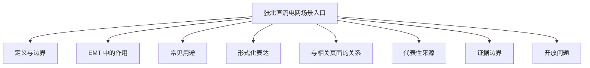

# 张北直流电网场景入口

## 定义与边界

张北直流电网场景入口用于承接围绕张北柔性直流工程、四端 MMC-HVDC 电网及其相关建模、控制、故障和稳定性研究的场景引用。它是工程/benchmark 入口，不是一般频变线路模型或单一控制算法页。

本页讨论的是张北工程作为场景的边界，不替代一般多端直流方法页。

## EMT 中的作用

在 EMT 仿真中，这类场景主要用于：

- 作为四端 MMC-HVDC 工程的 benchmark 背景；
- 连接工程参数、控制结构和故障研究页面；
- 作为国内多端直流、电网稳定性和保护研究的案例落脚点；
- 为张北四端工程与更一般的 MTDC 方法之间提供桥梁。

## 常见用途

- 作为张北工程参数和拓扑引用入口；
- 作为故障、保护和稳定性研究的工程背景；
- 作为与乌东德、鲁西等工程的对照场景。

## 形式化表达

作为多端直流工程入口，其最小系统级关系可抽象写为：

$$
\sum P_{station} - P_{loss} = 0
$$

实际 EMT 研究通常还需要补充站级控制、故障类型和线路/换流器详细参数。

## 与相关页面的关系

- [[zhangbei-four-terminal-vsc]]：四端直流工程场景入口。
- [[multi-terminal-dc]]：更一般的多端直流方法背景。
- [[dc-protection]]：工程故障与保护背景。
- [[hvdc-control]]：工程控制背景。
- [[model-verification-benchmark]]：benchmark 使用边界。

## 代表性来源

- [[electro-mechanical-transient-modeling-of-mmc-based-multi-terminal-hvdc-system-wi-15]]：张北四端工程背景。
- [[wave-function-and-multiscale-modeling-of-mmc-hvdc-system-for-wide-frequency-tran]]：张北工程多尺度建模背景。
- [[analysis-and-general-calculation-of-dc-fault-currents-in-mmc-mtdc-grids]]：多端直流故障电流与保护背景。

## 证据边界

本页不写无来源的具体工程参数、统一故障结论或所有工况通用的控制策略。具体结论必须绑定工程配置和验证工况。

## 开放问题

- 当前页尚未继续区分“张北工程场景页”和“基于张北工程的具体论文案例页”之间的边界。
- 若后续来源进一步收敛，部分链接可并入测试系统页或正式案例页。
