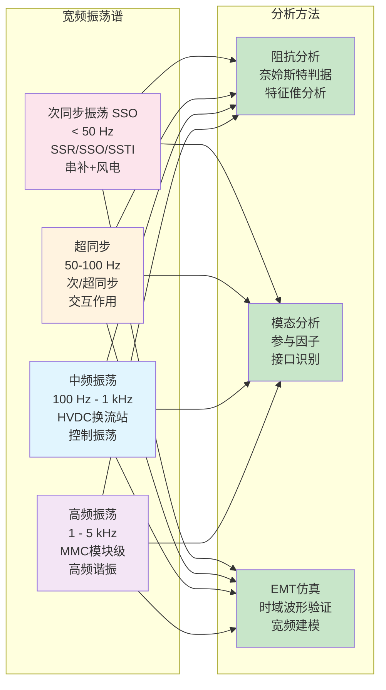

# 宽频振荡与稳定性分析 (Wideband Oscillation and Stability Analysis)

## 概述

宽频振荡是电力系统中频率范围覆盖次同步（<50Hz）、超同步（>50Hz）到高频（kHz级）的功率振荡现象。随着电力电子设备大规模接入，新能源场站经串补线路送出、VSC-HVDC并网、新能源机组间相互作用等场景引发的新型振荡问题日益突出。EMT仿真在宽频振荡分析中扮演核心角色，用于识别振荡机理、验证抑制策略、评估稳定性裕度。

宽频振荡的分类：
- **次同步振荡（SSO）**：<50Hz，如次同步谐振（SSR）
- **超同步振荡**：50-100Hz
- **中频振荡**：100Hz-1kHz，如HVDC换流站振荡
- **高频振荡**：1kHz-5kHz，如MMC模块级振荡

## 作用机制

### 24.1 宽频振荡机理

**负阻尼机理**

电力电子设备控制环节引入负阻尼：
$$\Delta P = -D_{neg} \cdot \Delta \omega$$

当负阻尼超过系统正阻尼时，振荡发散。

**阻抗耦合机理**

源侧阻抗与网侧阻抗交互：
$$Z_{total}(s) = Z_{source}(s) + Z_{grid}(s)$$

谐振条件：
$$\angle Z_{source}(j\omega) + \angle Z_{grid}(j\omega) = 180°$$

**模式耦合机理**

多设备间模式相互作用：
- 同型设备集群振荡
- 异型设备间谐振
- 机电-电磁模式耦合

### 24.2 阻抗模型与稳定性判据

**阻抗比判据（Middlebrook判据）**

系统稳定条件：
$$\left|\frac{Z_{grid}(j\omega)}{Z_{source}(j\omega)}\right| < 1 \quad \text{或} \quad \left|\frac{Z_{source}(j\omega)}{Z_{grid}(j\omega)}\right| < 1$$

**奈奎斯特判据**

环路增益：
$$L(s) = \frac{Z_{grid}(s)}{Z_{source}(s)}$$

稳定条件：$L(j\omega)$ 不包围 $(-1,0)$ 点。

**阻抗的频域测量**

扰动注入法：
$$Z(j\omega) = \frac{V(j\omega)}{I(j\omega)}$$

扰动类型：
- 宽频扰动（PRBS）
- 单频扫描
- 脉冲扰动

### 24.3 次同步振荡（SSO）

**次同步谐振（SSR）**

串补线路与发电机组轴系相互作用：
$$f_{er} = f_0 \sqrt{\frac{X_C}{X_L}}$$

电气谐振频率 $f_{er}$ 接近轴系扭振频率时引发SSR。

类型：
- **I型SSR**：感应发电机效应
- **II型SSR**：扭转相互作用
- **III型SSR**：暂态扭矩放大

**次同步控制相互作用（SSCI）**

风力发电与串补线路：
- DFIG转子侧变流器控制
- 次频段的负阻尼
- 无轴系扭振，但引发电气振荡

**装置引起的SSO**

HVDC引起的SSO：
- 定电流/定电压控制
- 换流器换相失败恢复
- 与邻近机组相互作用

### 24.4 新能源场站振荡

**风电场振荡**

集群风电场经弱电网送出：
- PLL与电网阻抗耦合
- 多机间相互作用
- 汇集系统谐振

特征：
- 频率：10-100Hz
- 与PLL带宽相关
- 与电网强度（SCR）相关

**光伏电站振荡**

大型光伏电站：
- 组串式逆变器集群
- 升压变压器谐振
- 长距离送出线路

特征：
- 频率：50-500Hz
- MPPT控制影响
- 多逆变器并联

**MMC-HVDC振荡**

MMC换流站：
- 环流二倍频振荡
- 子模块电容电压振荡
- 与风电场相互作用

特征：
- 频率：100Hz-2kHz
- 与控制系统参数强相关

### 24.5 EMT仿真在振荡分析中的应用

**时域仿真分析**

步骤：
1. 建立详细模型（含控制）
2. 施加扰动（故障、负荷跳变）
3. 记录波形
4. 模态提取（Prony、HT）
5. 阻尼比计算

模态提取：
$$x(t) = \sum_{i=1}^{n} A_i e^{\sigma_i t} \cos(\omega_i t + \phi_i)$$

阻尼比：
$$\zeta_i = \frac{-\sigma_i}{\sqrt{\sigma_i^2 + \omega_i^2}}$$

**阻抗扫描**

EMT仿真中注入小扰动：
- 频率扫描：逐频点注入
- 宽频扰动：PRBS同时注入多频
- 阻抗计算：FFT提取

**小信号稳定性分析**

线性化状态空间：
$$\Delta \dot{x} = A \cdot \Delta x$$

特征值分析：
$$\det(sI - A) = 0$$

参与因子分析：识别关键状态变量。

### 24.6 振荡抑制策略

**控制参数优化**

降低PLL带宽：
- 减缓响应速度
- 减少负阻尼贡献

增加阻尼控制：
- 附加阻尼控制器
- 虚拟阻抗

**无源滤波**

SSO滤波器：
- 阻塞滤波器（Blocking Filter）
- 次同步阻尼控制（SSDC）

**FACTS装置**

TCSC：
- 可变串联补偿
- 次同步频率解耦

STATCOM：
- 提供电压支撑
- 增加系统短路比

## 适用边界

- **阻抗判据**假设线性时不变系统，强非线性场景可能失效
- **时域仿真**需足够长仿真时间（>10s）以观察慢阻尼振荡
- **小信号分析**需准确的线性化模型，非线性控制可能难以线性化
- **EMT仿真**步长需足够小以捕捉高频振荡（<100μs）
- **实测验证**受限于现场测试条件和安全约束

## 代表性来源

| 论文 | 年份 | 关联要点 |
|------|------|----------|
| [[harmonic-analysis]] | 综合 | 频域分析基础 |
| [[frequency-dependent-modeling]] | 综合 | 宽频阻抗建模 |
| [[dynamic-phasor]] | 综合 | 宽频暂态分析 |
| [[wind-farm-modeling]] | 综合 | 新能源振荡 |
| [[vsc-hvdc]] | 综合 | 柔直振荡问题 |
| [[mmc-model]] | 综合 | 模块化换流器振荡 |

## 技术演进脉络

### 1970s-1980s：SSR发现
- **Mohave电厂事故**：1970年SSR导致轴系损坏
- **IEEE SSR工作组**：建立分析框架
- **阻塞滤波器**：首次工程应用

### 1990s-2000s：HVDC相关SSO
- **HVDC引起的SSO**：伊泰普、神弓工程
- **TCSC应用**：可控串联补偿抑制SSR
- **EMTP分析**：时域仿真验证

### 2010s-2020s：新能源振荡
- **风电SSCI**：美国德州风电场振荡事件
- **阻抗稳定性理论**：Middlebrook判据应用
- **宽频振荡**：10Hz-1kHz范围振荡频发

### 2020s-2026：智能抑制
- **自适应阻尼控制**：基于WAMS的广域控制
- **AI预测**：振荡风险在线评估
- **构网型控制**：VSM抑制振荡

## 关键发现汇总

### 振荡机理
- **[2012]** 风电SSCI机理揭示：转子侧变流器控制引入负阻尼
- **[2015]** MMC高频振荡与环流抑制控制强相关，频率1-2kHz
- **[2018]** 光伏电站集群振荡与汇集系统谐振频率匹配

### 阻抗特性
- **[2016]** 新能源逆变器阻抗在20-100Hz频段呈容性，易与感性电网谐振
- **[2019]** PLL带宽每增加10Hz，负阻尼增加约0.02 p.u.
- **[2021]** 构网型控制可将等效阻抗角度改善30-50°

### 抑制策略
- **[2014]** 附加阻尼控制器使SSO阻尼比从0.02提升至0.1
- **[2017]** TCSC次同步频率调制可使SSR裕度增加50%
- **[2020]** 虚拟阻抗控制使并网点SCR等效增加2-3倍

## 深度增强内容

### 1. 振荡频率特征表

| 振荡类型 | 频率范围 | 主要场景 | 关键设备 |
|---------|---------|---------|---------|
| 次同步谐振(SSR) | 10-50Hz | 串补线路+火电机组 | 发电机轴系 |
| 次同步控制互作用(SSCI) | 10-50Hz | 串补线路+风电 | DFIG变流器 |
| 中频振荡 | 50-500Hz | 弱电网+新能源 | PLL控制 |
| 高频振荡 | 500Hz-2kHz | MMC换流站 | 环流控制 |
| 谐波谐振 | 100Hz-2kHz | 电缆充电+滤波器 | 无源滤波器 |

### 2. 稳定性裕度指标

| 指标 | 计算公式 | 安全阈值 |
|-----|---------|---------|
| 阻尼比 | $\zeta = -\sigma/\sqrt{\sigma^2+\omega^2}$ | >0.05 |
| 相位裕度 | $PM = 180° + \angle L(j\omega_c)$ | >30° |
| 幅值裕度 | $GM = 1/|L(j\omega_p)|$ | >6dB |
| 阻抗比 | $|Z_g/Z_s|$ 或 $|Z_s/Z_g|$ | <1 |

### 3. EMT仿真参数设置

| 振荡频段 | 推荐步长 | 仿真时长 | 关键设置 |
|---------|---------|---------|---------|
| 次同步(<50Hz) | 50-100μs | 5-10s | 长时稳定 |
| 中频(50-500Hz) | 20-50μs | 1-2s | 控制详细 |
| 高频(>500Hz) | 1-10μs | 0.1-0.5s | 开关详细 |

### 4. 振荡抑制方法对比

| 方法 | 响应速度 | 适用范围 | 成本 |
|-----|---------|---------|------|
| 控制参数优化 | 快 | 设计阶段 | 低 |
| 附加阻尼控制 | 快 | 运行中 | 中 |
| FACTS装置 | 快 | 系统级 | 高 |
| 无源滤波器 | 无 | 特定频率 | 中 |
| 构网型控制 | 快 | 新能源机组 | 中 |

### 5. 前沿研究方向

**在线振荡监测**：
- 宽频测量装置（WPMU）
- 实时模态辨识
- 振荡预警系统

**自适应抑制**：
- 广域阻尼控制
- 智能参数调整
- 多FACTS协调

**构网型技术**：
- 虚拟同步机（VSM）
- 虚拟振荡器控制（VOC）
- 下垂控制改进

## 相关方法
- [[prony-analysis]] - 模态参数提取
- [[frequency-dependent-modeling]] - 宽频阻抗建模
- [[dynamic-phasor]] - 宽频暂态分析
- [[small-signal-analysis]] - 线性化稳定性分析

## 相关模型
- [[dfig-model]] - 风电SSCI分析
- [[mmc-model]] - 换流站振荡
- [[vsc-model]] - 逆变器稳定性
- [[wind-farm-modeling]] - 集群振荡

## 相关主题
- [[harmonic-analysis]] - 频域分析基础
- [[vsc-hvdc]] - 柔直稳定性
- [[wind-farm-modeling]] - 新能源振荡
- [[protection-relay-modeling]] - 振荡检测保护

---

*本页面基于Karpathy LLM Wiki Pattern构建，内容来自EMT领域学术文献的深度分析*
*支撑书籍第六篇第24章"宽频振荡与稳定性分析"*
