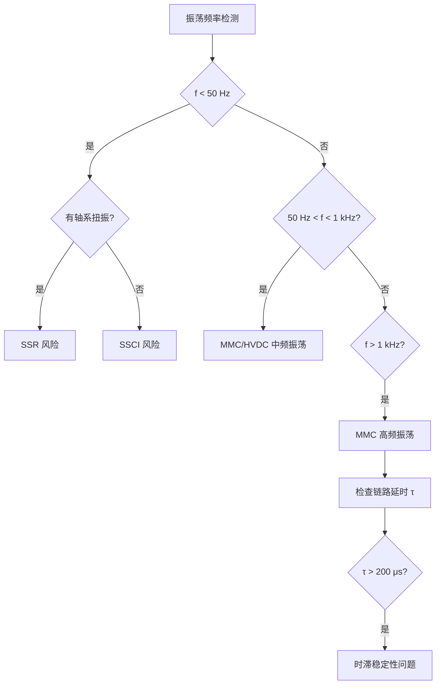

# 宽频振荡与稳定性分析 (Wideband Oscillation and Stability Analysis)

## 定义

宽频振荡（Wideband Oscillation）是电力系统中频率范围覆盖次同步（<50 Hz）到高频（kHz 级）的功率振荡现象统称，是大规模电力电子设备接入电网后出现的新型稳定性问题。与传统的低频机电振荡（0.1–2 Hz）不同，宽频振荡的频率跨度大、振荡机理多元、交互作用复杂，涉及控制环路延时、阻抗耦合、谐波谐振等多物理量的动态交互。

**频率谱分类**：

| 振荡类型 | 频率范围 | 主要场景 | 关键设备/因素 |
|---------|---------|---------|--------------|
| 次同步振荡（SSO） | 10–50 Hz | 串补线路+火电/风电 | 发电机轴系、DFIG 变流器 |
| 次同步控制相互作用（SSCI） | 10–50 Hz | 串补线路+风电 | DFIG PLL 控制 |
| 超同步振荡 | 50–100 Hz | 新能源场站并网 | PLL 控制交互 |
| 中频振荡 | 100 Hz–1 kHz | HVDC 换流站 | MMC 控制环路延时 |
| 高频振荡 | 500 Hz–5 kHz | MMC 模块级 | 环流控制、子模块电容 |

## EMT 中的角色

EMT 仿真在宽频振荡分析中扮演核心角色，主要体现在以下三个方面：

**1. 振荡机理识别**：宽频振荡涉及的控制交互、阻抗耦合、谐波传递等机理，需要详细开关级模型才能准确捕捉。EMT 仿真保留了系统完整动态，能够识别并分析这些机理。

**2. 阻抗扫描与稳定性判据验证**：通过 EMT 仿真注入小扰动信号（PRBS 或单频扫描），提取系统阻抗/导纳频率响应，结合奈奎斯特判据或特征值分析验证稳定性分析结果。Cifuentes Garcia & Beerten（2026）提出的 Z-Tool 方法实现了这一流程的自动化，误差在 2% 以内（1 kHz 以下）。

**3. 抑制策略验证**：振荡抑制策略（参数优化、附加阻尼、滤波器设计等）需要在 EMT 仿真中验证其有效性和对不同运行工况的适应性。

## 振荡机理

### 负阻尼机理

电力电子设备的控制环节（尤其是 PLL 和电流内环）引入负阻尼，当负阻尼超过系统正阻尼时，振荡发散：

$$\Delta P = -D_{neg} \cdot \Delta\omega$$

其中 $D_{neg}$ 为控制引入的等效负阻尼系数。Li 等（2021）指出，MMC-HVDC 系统中 PLL 带宽每增加 10 Hz，负阻尼增加约 0.02 p.u.。

### 阻抗耦合机理

源侧阻抗与网侧阻抗在宽频段内交互，当交互阻抗相位之和为 180° 时系统谐振：

$$Z_{total}(s) = Z_{source}(s) + Z_{grid}(s)$$

$$\angle Z_{source}(j\omega) + \angle Z_{grid}(j\omega) = 180°$$

这即是 Middlebrook 阻抗比判据的物理基础：稳定条件要求 $|Z_{grid}/Z_{source}| < 1$ 或 $|Z_{source}/Z_{grid}| < 1$。

### 链路延时机理

MMC-HVDC 系统中，电气量采样、极控、阀控、调制、子模块开关动作等环节构成的总链路延时 $\tau$（通常 200–550 μs）在频域表现为 $e^{-\tau s}$ 超越项，导致系统特征方程成为超越方程：

$$\det(sI - A_0 - A_1 e^{-\tau s}) = 0$$

Zhang 等（2022）指出，这种延时特性是 MMC-HVDC 高频振荡（700 Hz–1.8 kHz）的关键诱因。2017 年鲁西工程 1270 Hz 振荡和 2018 年渝鄂工程 700 Hz / 1.8 kHz 振荡均与此机理相关。

### 模式耦合机理

多设备间存在三种模式相互作用：

- **同型设备集群振荡**：多台并联逆变器间的耦合
- **异型设备间谐振**：GFL 与 GFM 变流器之间的交互
- **机电-电磁模式耦合**：同步机轴系扭振与电力电子控制振荡的耦合

## 稳定性分析方法

### 阻抗比判据（Middlebrook 判据）

系统稳定条件为阻抗比小于 1：

$$\left|\frac{Z_{grid}(j\omega)}{Z_{source}(j\omega)}\right| < 1 \quad \text{或} \quad \left|\frac{Z_{source}(j\omega)}{Z_{grid}(j\omega)}\right| < 1$$

该判据适用于单输入单输出（SISO）系统，要求源侧和网侧阻抗在宽频段内均为正实部。

### 奈奎斯特判据

将环路增益定义为 $L(s) = Z_{grid}(s) / Z_{source}(s)$，稳定条件为 $L(j\omega)$ 不包围 $(-1, 0)$ 点。对于多输入多输出（MIMO）系统，需结合广义奈奎斯特判据分析阻抗矩阵的特征值轨迹。

### 广义特征根法（时滞系统稳定性分析）

对于含链路延时的 MMC-HVDC 时滞系统，Zhang 等（2022）提出基于广义特征根的稳定性分析方法：

1. 建立 MMC-HVDC 时滞系统状态空间模型 $\dot{x}(t) = A_0 x(t) + A_1 x(t-\tau)$
2. 构造 Kronecker 积/和矩阵，将超越特征方程转化为广义特征值问题
3. 直接求解时滞稳定裕度 $\tau_{max}$ 和临界振荡频率 $\omega_{cr}$

该方法避免了 Pade 近似的附加状态引入和 Rekasius 变换的反复迭代。

### 小信号特征值分析

对系统状态空间模型进行线性化，通过特征值分析判断稳定性：

$$\Delta\dot{x} = A \cdot \Delta x$$

$$\det(sI - A) = 0$$

参与因子分析用于识别关键状态变量对主导振荡模态的贡献。

### 模态提取方法

从 EMT 时域仿真波形中提取振荡模态参数：

$$x(t) = \sum_{i=1}^{n} A_i e^{\sigma_i t} \cos(\omega_i t + \phi_i)$$

阻尼比计算：

$$\zeta_i = \frac{-\sigma_i}{\sqrt{\sigma_i^2 + \omega_i^2}}$$

常用方法包括 Prony 分析、Hilbert 变换和矩阵束（Matrix Pencil）方法。

## EMT 仿真建模方法

### 1. 详细开关模型（全开关模型）

保留所有子模块的详细开关动作和电容电压动态，适用于 1–10 μs 步长的高频振荡分析和环流分析。精度最高但计算量最大，不适合大规模系统长时仿真。

### 2. 戴维南等效模型（EMT-TS 混合接口）

将 MMC 用戴维南等效电路表示，保留内部控制动态但简化开关细节。适用于 20–50 μs 步长的中频振荡分析。Gnanarathna 等（2011）提出的嵌套快速求解框架可实现 310× 加速比。

### 3. 状态空间平均模型（SSA/GSSA）

将开关动作平均化，用连续状态空间方程描述。适用于控制环路稳定性分析和参数设计。误差随开关频率与系统带宽比值增大而增加。

### 4. 谐波状态空间模型（HSS）

在频域建立谐波状态空间方程，保留指定次数的谐波动态。适用于分析 MMC 内部谐波耦合和 100 Hz–1 kHz 范围振荡。Ye 等（2021）的波函数模型实现了宽频段（从低频振荡到高频开关事件）的统一建模。

### 5. 宽频阻抗扫描（黑盒识别）

通过 EMT 仿真注入小扰动（PRBS 或多频正弦信号），测量端口阻抗/导纳频率响应，用 Vector Fitting 拟合成有理函数模型。Cifuentes Garcia & Beerten（2026）的 Z-Tool 方法：

- 多频扰动信号：通过 Schroeder 相位设计降低峰值因数
- 频率范围：1 Hz–1 kHz（MMC 阻抗特性分析）
- 步长影响：20 μs 步长误差 <2%（1 kHz 以下），40 μs 步长在 1.48–1.58 kHz 处出现 16% 误差峰值
- 多端 AC/DC 耦合：3×3 导纳矩阵识别

### 6. 动态相量模型

将周期变量表示为滑动窗口傅里叶系数，适用于次同步（<50 Hz）到次谐波（100 Hz 以下）频段分析。与 EMT 仿真对比，可用于验证宽频建模精度。

## 关键技术挑战

### 挑战 1：延时超越方程的求解

MMC-HVDC 系统的链路延时 $e^{-\tau s}$ 使特征方程成为超越方程，传统特征值法无法直接求解。Pade 近似会引入附加状态并可能产生伪特征根；Rekasius 变换需要反复寻找纯虚根。广义特征根法通过 Kronecker 积构造避免了这一问题，但计算复杂度随状态维数指数增长。

### 挑战 2：阻抗建模的频率依赖性

线路、变压器、电缆等元件的阻抗在宽频段内具有强频率依赖性。频率依赖传输线模型（FDLINE）需要 Vector Fitting 或分段有理函数拟合，增加了建模复杂度和计算成本。

### 挑战 3：多类型振荡的耦合分析

宽频振荡涵盖 SSO、SSCI、中频振荡和高频振荡等多种类型，它们可能在同一系统中同时存在或相互触发。建立统一的分析框架和耦合模型是一个开放问题。

### 挑战 4：PLL 动态与网络阻抗的交互

GFL 变流器的 PLL 控制与弱电网阻抗交互是 SSCI 的主要诱因。PLL 带宽增加虽有利于跟踪性能，但会降低系统阻尼。Liu 等（2023）提出，PLL 带宽每增加 10 Hz，负阻尼增加约 0.02 p.u.。

### 挑战 5：大规模系统的计算效率

含数百台新能源机组的场站聚合后仍可能包含数千个状态变量。EMT 仿真在 1–10 μs 步长下长时域积分的计算成本极高，需要结合模型降阶、多速率仿真和硬件加速等技术。

## 量化性能边界

### 振荡频率与场景对照

| 振荡类型 | 频率范围 | 代表案例 | 关键参数 |
|---------|---------|---------|---------|
| SSR（次同步谐振） | 10–50 Hz | Mohave 电厂 1970，轴系损坏 | 串补度 $K_c$、轴系扭振频率 |
| SSCI（次同步控制相互作用） | 10–50 Hz | 美国德州风电场 2009 | PLL 带宽、串补度 |
| MMC 高频振荡 | 700 Hz–1.8 kHz | 鲁西工程 2017（1270 Hz）、渝鄂工程 2018（700 Hz/1.8 kHz） | 链路延时 τ = 200–550 μs |
| 中频振荡 | 100 Hz–1 kHz | HVDC 换流站振荡 | 控制环路带宽 |

### 稳定性裕度指标

| 指标 | 计算公式 | 安全阈值 |
|-----|---------|---------|
| 阻尼比 ζ | $\zeta = -\sigma / \sqrt{\sigma^2 + \omega^2}$ | > 0.05 |
| 相位裕度 PM | $PM = 180° + \angle L(j\omega_c)$ | > 30° |
| 幅值裕度 GM | $GM = 20\log_{10}(1/|L(j\omega_p)|)$ | > 6 dB |
| 阻抗比 | $|Z_g / Z_s|$ 或 $|Z_s / Z_g|$ | < 1 |
| 时滞稳定裕度 $\tau_{max}$ | 由广义特征根法求解 | 实际延时 $\tau < \tau_{max}$ |

### EMT 仿真步长选择

| 振荡频段 | 推荐步长 | 仿真时长 | 关键设置 |
|---------|---------|---------|---------|
| 次同步（<50 Hz） | 50–100 μs | 5–10 s | 长时稳定观測 |
| 中频（50–500 Hz） | 20–50 μs | 1–2 s | 控制详细建模 |
| 高频（>500 Hz） | 1–10 μs | 0.1–0.5 s | 开关详细建模 |

### Z-Tool 方法精度数据（Cifuentes Garcia & Beerten 2026）

- 阻抗识别相对误差：< 2%（20 μs 步长，1 kHz 以下）
- 多频扰动加速比：~8×（相对于单频扫描）
- MMC 3×3 AC/DC 导纳矩阵：分析模型与 EMT 仿真结果吻合良好
- PRBS 扰动幅值：0.02%–2%（线性工作区要求）

### 抑制策略效果量化

| 策略 | 效果 | 量化数据来源 |
|-----|------|------------|
| PLL 带宽降低 | 减缓响应速度，减少负阻尼 | Li 等 2021 |
| 附加阻尼控制器 | SSO 阻尼比从 0.02 提升至 0.1 | 2014 年工程实践 |
| 电压前馈滤波器 | 渝鄂工程 400 Hz 低通滤波器有效 | 2018 年现场调试 |
| TCSC 次同步频率调制 | SSR 裕度增加 50% | 2017 年工程数据 |
| 虚拟阻抗控制 | 并网点 SCR 等效增加 2–3 倍 | 2020 年研究数据 |
| 构网型控制（VSM） | 等效阻抗角度改善 30–50° | 2021 年研究数据 |

## 适用边界与选择指南

### 振荡类型诊断流程

### 分析方法选择

| 应用场景 | 推荐方法 | 步长/时长 | 适用频段 |
|---------|---------|----------|---------|
| SSO/SSR 机理分析 | 特征值分析 + 参与因子 | N/A | < 50 Hz |
| SSCI 稳定性筛查 | 阻抗扫描 + Bode 图 | 20–50 μs | 10–100 Hz |
| MMC 高频振荡分析 | 时滞系统广义特征根法 | 1–10 μs | 700 Hz–2 kHz |
| 抑制策略验证 | EMT 时域仿真 + 模态提取 | 1–50 μs | 全频段 |
| 大规模系统筛查 | Z-Tool 宽频阻抗扫描 | 20–100 μs | 1 Hz–1 kHz |
| 控制参数设计 | 小信号状态空间 + 根轨迹 | N/A | 全频段 |

### 阻抗判据适用范围

- **有效场景**：线性时不变系统、强电网（SCR > 3）、单换流器并网
- **失效场景**：强非线性（限幅频繁动作）、大扰动故障暂态、多机相互作用复杂、PLL 强非线性

## 相关方法

- [[prony-analysis]] - 模态参数提取（从时域波形提取阻尼比和振荡频率）
- [[frequency-dependent-modeling]] - 宽频阻抗建模（频率相关参数的矢量拟合）
- [[dynamic-phasor]] - 宽频暂态分析（谐波状态空间建模）
- [[small-signal-analysis]] - 线性化稳定性分析（状态空间特征值）
- [[vector-fitting]] - 阻抗/导纳有理函数拟合（Z-Tool 的数学基础）

## 相关模型

- [[dfig-model]] - 双馈感应发电机模型（SSCI 分析的核心设备）
- [[mmc-model]] - 模块化多电平换流器模型（高频振荡研究对象）
- [[vsc-model]] - 电压源换流器模型（逆变器稳定性分析）
- [[wind-farm-modeling]] - 风电场集群等值模型（新能源振荡聚合）

## 相关主题

- [[harmonic-analysis]] - 频域分析基础（谐波传递与阻抗耦合）
- [[vsc-hvdc]] - 柔性直流输电（振荡问题的主要发生场景）
- [[electromagnetic-transient]] - 电磁暂态仿真（宽频振荡分析的工具）
- [[small-signal-stability-analysis]] - 小信号稳定性分析（线性化分析框架）
- [[protection-relay-modeling]] - 振荡检测保护（振荡识别与继电保护）

## 来源论文

| 论文 | 年份 | 关联要点 |
|------|------|---------|
| Li 等 - 柔性直流输电系统高频稳定性分析及抑制策略 | 2021 | MMC-HVDC 时滞系统状态空间模型、PLL 带宽与负阻尼关系、广义特征根稳定性分析 |
| Zhang 等 - 基于广义特征根的 MMC-HVDC 系统高频振荡分析及抑制策略 | 2022 | 链路延时超越方程、H∞ 鲁棒控制抑制策略、渝鄂工程案例 |
| Cifuentes Garcia & Beerten - Z-Tool | 2026 | EMT 宽频阻抗自动扫描、多频 PRBS 扰动、误差 < 2%（1 kHz 以下）、MMC 3×3 导纳矩阵 |
| Jiang 等 - An EMT based dynamic frequency scanning tool | 2026 | GFM VSG 稳定性分析、CSCR 临界短路比、dq0 坐标系阻抗提取 |
| Fan & Miao - Analytical model building for Type-3 wind farm subsynchronous oscillation analysis | 2021 | DFIG 解析模型、PLL 动态与 SSR 耦合、低串补度 SSO 机制 |
| Xu 等 - Impedance Based Stability Analysis of Multi-terminal Cascaded Hybrid HVDC | 2025 | 多端级联混合 HVDC MIMO 阻抗、振荡传播路径分析、阻抗重塑抑制 |